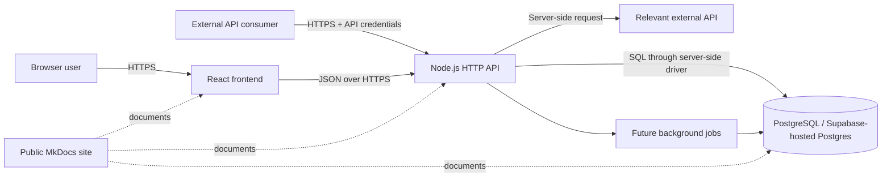

# Architecture overview

## Context

The project requires a separate frontend and backend, a team-designed hand-written HTTP API, a database, a public documentation website, authentication through an established provider or library, CI/CD, automated testing, and a relevant external API integration.

## Selected foundation

A background worker is shown as a future deployment boundary for batch imports, large exports, and expensive derivations. It should only be introduced when asynchronous work is implemented; it is not required for the initial scaffold.

## Components and responsibilities

### React frontend

- Render accessible and responsive user journeys.
- Collect and perform user-friendly client-side validation.
- Call only documented backend endpoints for application data.
- Handle loading, empty, error, unauthorised, and offline/unreachable states.
- Never contain database credentials or authoritative business rules.

### Node.js backend

- Expose the versioned hand-written HTTP API.
- Validate input and authenticate/authorise protected requests.
- Enforce submitter scope, review workflows, traceability, and business rules.
- Read and write the database through server-side repositories.
- Call the external API while controlling credentials, retries, timeouts, and failure handling.
- Produce stable error responses, logs, metrics, and audit evidence.

### Shared contracts package

- Hold request/response and event schemas shared across applications.
- Provide TypeScript types derived from validation schemas.
- Contain no database access, secrets, business logic, or authorisation decisions.

### Database

- Store source event data, submissions, review/correction history, definitions, derived results, and releases.
- Enforce integrity with constraints and transactions.
- Support traceability and efficient filtered queries through deliberate indexes.

### Documentation site

- Publish architecture, API, database, setup, testing, dependencies, security, deployment, methodology, and AI-use documentation.
- Remain publicly accessible without requiring an account.

## Data flow

1. An account with the `submitter` or `admin` role uploads or sends event data to the backend API.
2. The backend authenticates the submitter and checks their authorised competition scope.
3. The backend validates the payload against the versioned event schema.
4. Valid data is staged or stored transactionally; invalid data returns actionable errors.
5. Accepted event changes trigger only the dependent statistic calculations.
6. Published API responses and dataset releases retain provenance to submissions, events, and definition versions.
7. The frontend and external consumers obtain data from the backend API, never directly from generated database endpoints.

## Security boundaries

- Treat all browser and external-consumer input as untrusted.
- Keep provider secrets, database credentials, external API keys, and service tokens server-side.
- Use an established authentication provider/library; do not create password hashing, reset tokens, or session cryptography from scratch.
- Authorise every protected route based on backend-verified identity and role/scope.
- Rate-limit public/consumer endpoints before exposing them broadly.
- Do not log credentials, tokens, full sensitive payloads, or unnecessary personal data.

## Deployment boundaries

The frontend, backend, database, and documentation site must be independently deployable. The initial Azure deployment design is documented under `infra/azure/` and must be updated once exact services are selected and tested.

## Trade-offs

A monorepo simplifies shared tooling, atomic Pull Requests, and contracts while preserving separate deployable applications. Its main risk is accidental coupling. The folder boundaries, backend-only database rule, and CI checks must be enforced during review.
