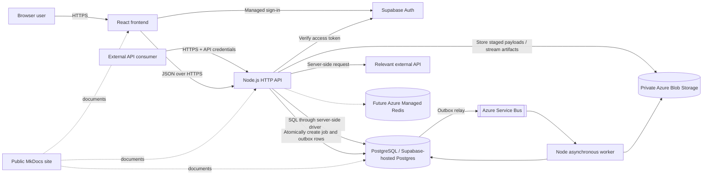

# Architecture overview

## Context

The project requires a separate frontend and backend, a team-designed hand-written HTTP API, a database, a public documentation website, authentication through an established provider or library, CI/CD, automated testing, and a relevant external API integration.

## Selected foundation

```mermaid
flowchart LR
    User[Browser user] -->|HTTPS| Frontend[React frontend]
    Consumer[External API consumer] -->|HTTPS + API credentials| API[Node.js HTTP API]
    Frontend -->|JSON over HTTPS| API
    Frontend -->|Managed sign-in| Auth[Supabase Auth]
    API -->|Verify access token| Auth
    API -->|SQL through server-side driver| DB[(PostgreSQL / Supabase-hosted Postgres)]
    API -->|Server-side request| External[Relevant external API]
    API -->|Store staged payloads / stream artifacts| Files[(Private Azure Blob Storage)]
    API -->|Atomically create job and outbox rows| DB
    DB -->|Outbox relay| Queue[[Azure Service Bus]]
    Queue --> Worker[Node asynchronous worker]
    Worker --> DB
    Worker --> Files
    API -.-> Cache[(Future Azure Managed Redis)]
    Docs[Public MkDocs site] -. documents .-> Frontend
    Docs -. documents .-> API
    Docs -. documents .-> DB
```

The independently deployable background-worker boundary is implemented for batch validation,
batch publication and full dataset-release generation. The API atomically persists domain state and
outbox rows in PostgreSQL; the worker relays queued identifiers through Azure Service Bus Standard
and handles each operation idempotently. Private Azure Blob Storage retains staged source bytes and
immutable release artifacts in separate containers. Caching retains a separate adoption boundary:
the current fixture-statistics cache is PostgreSQL-backed, while external Redis remains optional.

## Later-tier service decisions

Issue #55 records the initial recommendations for later-tier services. Issue #356 accepted ADR-010
and ADR-011 for Intermediate implementation, and the repository now implements their worker/outbox
and private-object-storage boundaries. ADR-009 and ADR-012 remain proposals for optional external
caching and Advanced live ingestion.

| Concern             | Direction                                                                                                                                                | Decision record                                                                                                                                                                         |
| ------------------- | -------------------------------------------------------------------------------------------------------------------------------------------------------- | --------------------------------------------------------------------------------------------------------------------------------------------------------------------------------------- |
| Caching             | Measure and optimise PostgreSQL first; use versioned cache-aside reads in Azure Managed Redis only for demonstrated hot paths.                           | [ADR-009](https://sdp.ms.wits.ac.za/git-push-pray/Sport-Analytics-Tool/src/branch/main/evidence/decisions/ADR-009-cache-and-invalidation.md){ target="_blank" rel="noopener" }          |
| Background jobs     | Commit domain state and a PostgreSQL outbox atomically, relay identifiers through Azure Service Bus Standard, and process them with idempotent workers.  | [ADR-010](https://sdp.ms.wits.ac.za/git-push-pray/Sport-Analytics-Tool/src/branch/main/evidence/decisions/ADR-010-background-jobs-and-workers.md){ target="_blank" rel="noopener" }     |
| File storage        | Keep metadata and provenance in PostgreSQL and private bytes in Azure Blob Storage behind a backend-owned adapter.                                       | [ADR-011](https://sdp.ms.wits.ac.za/git-push-pray/Sport-Analytics-Tool/src/branch/main/evidence/decisions/ADR-011-file-and-object-storage.md){ target="_blank" rel="noopener" }         |
| Live ingestion      | Normalise provider input through the existing acceptance path, persist replay cursors in PostgreSQL, and deliver public updates with server-sent events. | [ADR-012](https://sdp.ms.wits.ac.za/git-push-pray/Sport-Analytics-Tool/src/branch/main/evidence/decisions/ADR-012-live-event-transport-and-replay.md){ target="_blank" rel="noopener" } |
| API consumer access | Use one canonical public-resource hierarchy; optional API-key identification selects managed consumer limits and telemetry.                              | [ADR-016](https://sdp.ms.wits.ac.za/git-push-pray/Sport-Analytics-Tool/src/branch/main/evidence/decisions/ADR-016-api-consumer-access-model.md){ target="_blank" rel="noopener" }       |

## Components and responsibilities

### React frontend

- Render accessible and responsive user journeys.
- Collect and perform user-friendly client-side validation.
- Call only documented backend endpoints for application data.
- Handle loading, empty, error, unauthorised, and offline/unreachable states.
- Never contain database credentials or authoritative business rules.

### Node.js backend

- Expose the versioned hand-written HTTP API.
- Validate input and authenticate/authorise protected requests.
- Enforce submitter scope, review workflows, traceability, and business rules.
- Read and write the database through server-side repositories.
- Call the external API while controlling credentials, retries, timeouts, and failure handling.
- Produce stable error responses, logs, metrics, and audit evidence.

### Shared contracts package

- Hold request/response and event schemas shared across applications.
- Provide TypeScript types derived from validation schemas.
- Contain no database access, secrets, business logic, or authorisation decisions.

### Database

- Store source event data, submissions, review/correction history, definitions, derived results, and releases.
- Enforce integrity with constraints and transactions.
- Support traceability and efficient filtered queries through deliberate indexes.

### Asynchronous worker

- Relay PostgreSQL outbox rows to Azure Service Bus and consume durable job messages.
- Validate staged batch packages, publish reviewed batches and generate immutable dataset releases.
- Read/write PostgreSQL and the private object stores through server-side credentials only.
- Expose health/readiness information and stop safely after draining in-flight work.

### Documentation site

- Publish architecture, API, database, setup, testing, dependencies, security, deployment, methodology, and AI-use documentation.
- Remain publicly accessible without requiring an account.

## Data flow

### Synchronous event submissions

1. An account with the `submitter` or `admin` role sends event data to the backend API.
2. The backend verifies identity, checks the authorised competition scope and validates the versioned event schema.
3. Valid events, provenance and dependent-statistic work are persisted transactionally; invalid input returns actionable errors.
4. Public reads derive their results from accepted current revisions through the backend API.

### Asynchronous batch ingestion and releases

1. A submitter uploads a batch package to the API; the API records batch metadata and stores the staged bytes privately.
2. The API commits the associated job and PostgreSQL outbox record in the same transaction.
3. The worker relays the outbox record to Azure Service Bus, consumes the job, then validates the staged package in durable chunks.
4. A reviewer resolves references and accepts or rejects the validated batch; the worker publishes accepted items and preserves the revision/provenance trail.
5. Dataset-release jobs follow the same durable path: the worker writes the immutable artifact to private Blob Storage, while PostgreSQL retains its version and checksum.
6. Frontend users and external consumers retrieve application data and dataset artifacts through the backend API; they never query generated database endpoints or Blob Storage directly.

## Security boundaries

- Treat all browser and external-consumer input as untrusted.
- Keep provider secrets, database credentials, external API keys, and service tokens server-side.
- Use an established authentication provider/library; do not create password hashing, reset tokens, or session cryptography from scratch.
- Authorise every protected route based on backend-verified identity and role/scope.
- Rate-limit public/consumer endpoints before exposing them broadly.
- Do not log credentials, tokens, full sensitive payloads, or unnecessary personal data.

## Deployment boundaries

The frontend, backend, worker, database, and documentation site are separate deployment boundaries.
The frontend and documentation site deploy to Cloudflare Pages; the backend and worker deploy as
Azure Container Apps; PostgreSQL and managed identity are supplied by Supabase. See
[Deployment overview](../deployment/overview.md), [backend hosting](../deployment/azure-backend.md),
and [worker hosting](../deployment/azure-worker.md) for deployment and recovery controls. Any
proposed advanced service must pass its ADR adoption gate and gain provisioning, deployment,
recovery, and cost evidence before it is described as deployed.

## Trade-offs

A monorepo simplifies shared tooling, atomic Pull Requests, and contracts while preserving separate deployable applications. Its main risk is accidental coupling. The folder boundaries, backend-only database rule, and CI checks must be enforced during review.

## Related reading paths

- [Architecture & Data](../architecture-and-data.md) — recommended architecture/database/security reading order.
- [Product & API](../product-and-api.md) — externally visible product and API behaviour.
- [Deployment & Operations](../deployment/overview.md) — hosted topology, recovery and deployment controls.

## AI Declaration

The issue #55 advanced-service decision summary was drafted and reconciled with the repository with
the assistance of Codex[GPT-5]. The issue #356 adoption status was documented with the assistance of
Codex[GPT-5].
The issue #365 worker target status was documented with the assistance of Codex[GPT-5].
The Issue #364 current-state architecture reconciliation was reviewed and edited with the
assistance of ChatGPT-Web[GPT-5.6 Sol].
The documentation reading-path links were added with the assistance of ChatGPT-Web[GPT-5.6 Sol].
The issue #820 API consumer access-model decision link was added with the assistance of
Codex[GPT-5].
The Issue #883 final architecture reconciliation was reviewed and edited with the assistance of
Codex[GPT-5].
