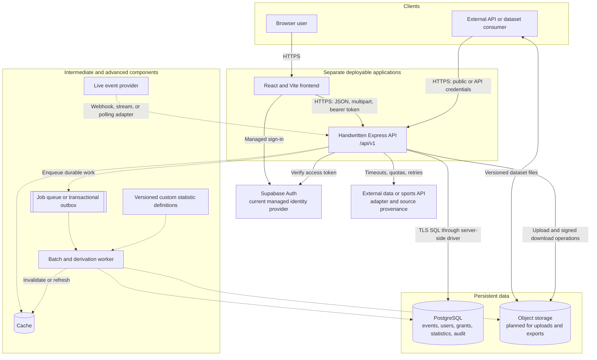
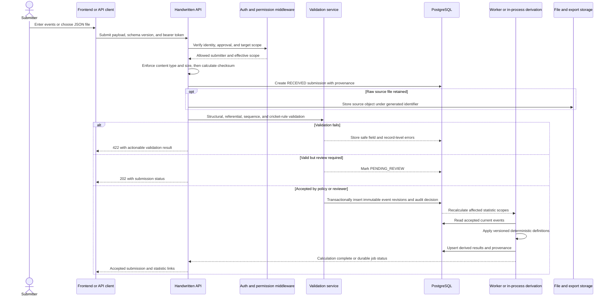
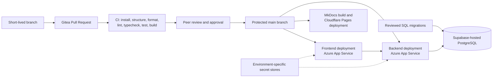

# System architecture and development roadmap

**Status:** Target architecture; foundation components are implemented, while later-tier
components are explicitly marked as planned.  
**Related issues:** #38, #73
**Last updated:** 12 August 2026

## 1. Purpose and architectural principles

The Sport Analytics Tool is an event-driven cricket analytics platform. It accepts
traceable match-event submissions, validates and stores accepted events, derives statistics
from those events, and publishes results through a web application, dataset exports, and a
versioned HTTP API.

The design follows these principles:

1. The React frontend and Express backend are separate applications and separate deployment
   units. They communicate through the documented HTTP API.
2. The handwritten backend is the only application-data boundary. The frontend and external
   consumers never use database-generated REST or GraphQL endpoints.
3. PostgreSQL event records are the source of truth. Published statistics are derived values,
   not independently entered totals.
4. Authentication proves identity; backend authorisation separately determines roles,
   approval state, and competition, season, or fixture scope.
5. Every submission, correction, statistic, and export must retain provenance.
6. Basic functionality is delivered before asynchronous, cached, live, or user-defined
   functionality is introduced.
7. Planned components must not be presented as implemented. The architecture can grow by
   adding workers and adapters without replacing the frontend, API, or event model.

## 2. Current decisions and terminology

The approved event model covers T20 cricket. The current data source is Cricsheet, and the
agreed scope recorded in ADR-003 is eleven franchise competitions plus men's and women's T20
internationals. The exact required statistic catalogue is still a dependency of issue #37.

### Authentication provider

The project uses **Supabase Auth** as its managed authentication foundation, with
**Google OAuth** as the initial sign-in provider.

ADR-004 supersedes the earlier Firebase decision in ADR-002. The repository now implements
Supabase token verification in the Express backend using
`supabase.auth.getUser(accessToken)`. Firebase Authentication is therefore not part of the
current runtime architecture and must not be implemented alongside Supabase Auth.

The authentication flow is:

1. The React frontend initiates the managed Google OAuth flow through Supabase Auth.
2. Supabase Auth issues a user session and access token.
3. The frontend sends the access token to the handwritten Express API using a bearer token.
4. The backend verifies the token with Supabase Auth.
5. The backend maps the verified provider subject to the application's own account, role,
   approval state and scoped permissions.

Authentication and authorisation remain separate:

- **Supabase Auth** proves the user's identity.
- **The Sport Analytics backend** determines what the user is allowed to do.

Application users are identified using the provider-neutral combination:

```text
(auth_provider, auth_subject)
```

This prevents authentication-provider details from becoming coupled to competition, event,
submission or statistic data.

The written lecturer ruling currently stored in the repository explicitly approves using
Supabase as hosted PostgreSQL while avoiding its generated data API. It does not explicitly
mention Supabase Auth.

Supabase Auth is therefore the team's selected and implemented authentication foundation.
Any required stakeholder or lecturer confirmation for its production use must remain
recorded as an open compliance decision until confirmed.

## 3. High-level architecture



Solid connections are Basic-tier boundaries or selected foundations. Dotted connections are
Intermediate or Advanced additions. Object storage is shown as planned because PostgreSQL
should store file metadata and provenance, not necessarily large source and export objects.
Its provider has not yet been selected.

### Trust boundaries

- Browser input, uploaded files, external API responses, and consumer requests are untrusted.
- The backend API is the policy-enforcement point for validation, authorisation, business
  rules, quotas, and audit logging.
- Authentication-provider configuration safe for a browser may be exposed through frontend
  environment variables; database credentials, elevated auth keys, external API secrets, and
  storage credentials remain server-side.
- Only the backend and future workers connect to PostgreSQL or object storage with write
  privileges.
- Workers use the same domain services and validation rules as synchronous API operations;
  asynchronous execution must not create a second set of business rules.

## 4. Component responsibilities

| Component                               | Responsibility                                                                                                                                                                                                                                          | Delivery tier and state                                                                                      |
| --------------------------------------- | ------------------------------------------------------------------------------------------------------------------------------------------------------------------------------------------------------------------------------------------------------- | ------------------------------------------------------------------------------------------------------------ |
| React frontend (`apps/frontend`)        | Render responsive and accessible search, dashboard, authentication, submission, review, and export journeys. Perform helpful client validation and send application data only to the backend.                                                           | Basic; application scaffold exists, product journeys are planned.                                            |
| Express backend (`apps/backend`)        | Own `/api/v1`, authoritative validation, authentication middleware, role and scope checks, event ingestion, derivation orchestration, queries, exports, external integrations, audit logs, and safe error responses.                                    | Basic; health, current-profile, and public-read endpoints exist; later domain modules are planned.           |
| Shared contracts (`packages/contracts`) | Hold versioned request/response schemas and TypeScript types shared by the applications. It contains no secrets, database access, or authorisation decisions.                                                                                           | Basic; health contract exists and domain contracts are planned.                                              |
| Supabase Auth                           | Manage Google OAuth and identity lifecycle flows; issue tokens that the backend verifies. It proves identity but grants no application permission.                                                                                                      | Basic; selected and backend verification is implemented.                                                     |
| Backend authorisation                   | Map the verified provider subject to `app_user`, enforce account status, one of the `viewer`, `submitter`, or `admin` roles, and scoped grants on every protected route.                                                                                | Basic; account synchronization, profile, administrator, submitter, and competition policies are implemented. |
| PostgreSQL                              | Store identity mappings, grants, reference data, submissions, immutable event revisions, review and correction history, statistic definitions/results, export metadata, and audit records. Enforce integrity with constraints and transactions.         | Basic; hosted connection and event model are approved, full migrations are planned.                          |
| Submission and validation service       | Accept manual JSON and file submissions, identify duplicates, apply versioned structural and cricket-domain rules, normalise source data, and produce actionable validation results.                                                                    | Basic.                                                                                                       |
| Derivation service                      | Calculate deterministic fixture, season, competition, and career statistics from accepted current event revisions; record the definition version and input provenance.                                                                                  | Basic for required statistics; versioned/custom definitions are Advanced.                                    |
| File and export service                 | Enforce upload type/size limits, calculate checksums, retain source provenance, create immutable release manifests, and provide authorised downloads.                                                                                                   | Basic for small synchronous files; object storage and asynchronous large exports are Intermediate.           |
| External integration adapter            | Isolate provider formats and credentials; apply timeouts, bounded retries, rate limits, schema validation, idempotency, and source/retrieval metadata. Cricsheet is the current historical file source; the required runtime external API is undecided. | Basic adapter and one integration required.                                                                  |
| Worker and job queue                    | Process large imports, recomputation, exports, and scheduled synchronisation outside request timeouts. Jobs are idempotent, retryable, observable, and dead-lettered after bounded failures.                                                            | Intermediate.                                                                                                |
| Cache                                   | Reduce repeated reads of published statistics and reference data. Cache entries are keyed by data and definition version and invalidated after accepted corrections or recalculation.                                                                   | Intermediate; introduce only after measurement.                                                              |
| Live ingestion adapter                  | Receive or poll live events, order and deduplicate them, handle late corrections, and pass them through the same validation and acceptance path as file submissions.                                                                                    | Advanced.                                                                                                    |
| Custom statistic engine                 | Store reviewed, versioned definitions and calculate results in a restricted expression model. It must not execute arbitrary user code or unbounded database queries.                                                                                    | Advanced.                                                                                                    |
| MkDocs site                             | Publish architecture, API, database, security, deployment, testing, methodology, and data-source documentation independently of the product applications.                                                                                               | Basic; deployed separately to Cloudflare Pages.                                                              |

## 5. Authorisation model

The minimum target model combines role-based access control with scoped grants. Role names
remain subject to group approval, but the capabilities and separation of duties below should
be preserved.

| Actor           | Typical permissions                                                                                                                                |
| --------------- | -------------------------------------------------------------------------------------------------------------------------------------------------- |
| Public viewer   | Read published fixtures, statistics, and public dataset-release metadata.                                                                          |
| Registered user | Public-viewer access plus account functions and their own submission history where applicable.                                                     |
| Submitter       | Create submissions only within explicit competition, season, and optionally fixture grants; view their own validation results; submit corrections. |
| Reviewer        | Inspect validation evidence and accept or reject submissions within assigned scope; cannot silently rewrite source events.                         |
| Administrator   | Approve or suspend submitters, manage roles and scoped grants, and audit decisions. Administrative actions are themselves audited.                 |
| API consumer    | Read only the endpoints and datasets allowed by its API credential and quota; it receives no user or submission privilege by default.              |

A submission-capable account must satisfy all of the following:

```text
verified identity
AND active application account
AND application role = submitter OR admin
AND active scoped grant covering the target competition/season/fixture
AND route-specific permission
```

The implemented persistence foundation extends `app_user` with a three-value application role and
last-authenticated time, plus `submitter_competition_scope` grants. The older submitter-approval
state remains only as deprecated request-workflow data. Approval-management work may later add
approver, reason, revocation, and expiry audit fields without changing the route-policy boundary.
Denied checks return `403 Forbidden`; missing, invalid, expired, or revoked identity tokens return
`401 Unauthorized`. The frontend may hide unavailable actions for usability, but frontend state is
never an authorisation control.

## 6. Authentication and authorisation flow

```mermaid
sequenceDiagram
    actor User
    participant UI as React frontend
    participant Auth as Supabase Auth
    participant API as Express API
    participant DB as PostgreSQL

    User->>UI: Start managed Google sign-in
    UI->>Auth: OAuth request with approved redirect URI
    Auth-->>UI: Session and access token
    UI->>API: Protected request with Bearer token
    API->>Auth: Verify token using getUser(token)
    alt Token missing, invalid, expired, or revoked
        API-->>UI: 401 Unauthorized
    else Verified provider identity
        Auth-->>API: Stable provider subject
        API->>DB: Upsert app_user; load status, role, and scoped grants
        alt Account or permission check fails
            API-->>UI: 403 Forbidden
        else Route and resource scope allowed
            API->>DB: Execute transaction and append audit evidence
            API-->>UI: Safe response
        end
    end
```

Important controls are:

- accept bearer tokens only over HTTPS and never log them;
- validate identity on the backend rather than trusting decoded browser claims;
- re-check permissions for every protected request and target resource;
- prevent users from approving their own submitter status or expanding their own scope;
- require step-up or recent authentication for destructive account or administration actions
  if supported by the selected provider;
- keep elevated provider credentials in the backend secret store and use them only for the
  narrow administrative operations that require them; and
- audit role, grant, review, correction, and account-status changes with actor and timestamp.

## 7. Event submission to calculated statistics

### End-to-end flow



For the Basic tier, bounded submissions and required fixture statistics may be validated and
derived synchronously. Before processing becomes asynchronous, event acceptance and job
creation must be made atomic with a transactional outbox or equivalent pattern so an accepted
event cannot exist without its recalculation job.

### Validation layers

1. **Transport:** HTTPS, supported media type, request/file size, filename handling, and
   decompression limits.
2. **Contract:** versioned JSON schema, required fields, types, ranges, and unknown-field
   policy.
3. **Reference:** stable competition, fixture, team, and player identifiers; no name-based
   player joins.
4. **Cricket semantics:** innings/delivery ordering, team membership, extras, wickets,
   super-over flags, miscounted overs, outcome forms, and other approved vocabulary.
5. **Idempotency:** source reference, revision, checksum, and natural event identity prevent
   duplicate ingestion while allowing corrections.
6. **Permission:** submitter grant covers every target resource in the submission.
7. **Review:** policy determines whether a structurally valid submission can be auto-accepted
   or needs an independent reviewer.

Validation errors are stored against the submission and returned without exposing internal
queries or secrets. Multi-record acceptance is transactional: the database receives all
accepted records or none of them.

### Corrections and derivation

Delivery event content is immutable. A correction inserts a new revision, marks the previous
live revision as superseded, and retains the original sequence and audit history. Derivation
reads only the approved current-event view.

Required statistics begin with the group-approved catalogue from #37. The engine must cover
the event-model rules already approved in #27, including wides and balls faced, bowler extras,
non-boundary flags, innings-level penalty runs, actual legal-ball counts, stable player IDs,
bowler-credit dismissal kinds, and the agreed super-over convention.

Each stored result identifies:

- statistic definition and version;
- scope, such as fixture, innings, player, season, or career;
- input event revision set or reproducible data version;
- calculation status and timestamp; and
- value and units.

A correction marks only dependent results stale, recalculates them, and invalidates matching
cache keys. Consumers must never observe a cache entry for a superseded data/definition
version.

## 8. Files, datasets, and external integration

### Uploads and source artefacts

- Uploads enter through the backend; the browser never receives storage write credentials.
- The API allow-lists formats, sanitises display names, ignores client filesystem paths,
  generates object identifiers, enforces compressed and expanded size limits, and calculates
  SHA-256 checksums.
- PostgreSQL stores the submission, checksum, media type, object reference, source/retrieval
  metadata, validation status, and owner. Object storage holds large bytes when selected.
- Duplicate checksums are not sufficient by themselves: source reference and source revision
  determine whether a file is a replay, correction, or different fixture.
- Retention, malware scanning, and deletion rules must be agreed before arbitrary public file
  uploads are enabled.

### Dataset exports

Small filtered exports may stream from the API. Large or full releases become worker jobs and
return `202 Accepted` with a status URL. Completed immutable releases include a version,
scope, creation time, schema/statistic-definition versions, row or event counts, licence and
provenance notes, and checksums. Downloads use short-lived authorised links where necessary;
public releases may use stable public links.

### External integration

Cricsheet's JSON archive is the approved historical source and already has a reproducible
download and manifest process. It is a file feed, not a substitute for the project's required
runtime external API integration. The team must select a relevant API based on stakeholder
value, licence, T20 coverage, quotas, correction behaviour, and testability.

All providers are isolated behind adapters that convert external payloads into the internal
submission contract. Provider calls use secret management, explicit timeouts, bounded retries
with jitter, rate-limit handling, circuit breaking where appropriate, schema checks, and
observable failures. Raw provider references, retrieval time, licence, version, and checksum
are retained for provenance. An unavailable provider must degrade only the dependent feature,
not health checks, historical statistics, or unrelated API routes.

## 9. Basic, Intermediate, and Advanced evolution

| Tier         | Architecture need                                                                                                                                                                                                                                                                                                                                  | Completion signal                                                                                                                                                       |
| ------------ | -------------------------------------------------------------------------------------------------------------------------------------------------------------------------------------------------------------------------------------------------------------------------------------------------------------------------------------------------- | ----------------------------------------------------------------------------------------------------------------------------------------------------------------------- |
| Basic        | Separate responsive frontend and handwritten versioned backend; PostgreSQL persistence; managed identity; backend roles and submitter competition scopes; event/file submission; layered validation; traceable corrections; required derived statistics; one external integration; small exports; automated tests; CI/CD and public documentation. | A user can submit in-scope T20 events, see validation outcomes, and retrieve independently verified statistics and a documented dataset/API from deployed applications. |
| Intermediate | Durable background jobs for batch ingestion, large recalculation and exports; object storage; job status and retries; caching of measured hot reads; richer review workflow; API credentials/quotas; observability, backup/restore, and performance testing.                                                                                       | Large real-data operations complete outside HTTP timeouts, survive retries without duplication, expose useful status, and meet agreed performance/recovery targets.     |
| Advanced     | Live event ingestion and correction handling; versioned custom statistic definitions; dependency-aware incremental recomputation; safe expression limits; change feeds/release differences; stronger scaling and cache invalidation.                                                                                                               | Live corrections converge on auditable results, and approved custom definitions calculate reproducibly without arbitrary code execution or unbounded resource use.      |

Promotion to a later tier is evidence-based. Batch processing is introduced when request-time
work exceeds agreed limits; caching is introduced after profiling; live ingestion depends on a
licensed reliable feed; and custom statistics depend on an approved safe definition model.

## 10. Deployment and CI/CD



### Environments and deployment units

- **Local:** Vite frontend on port 5173 and Express API on port 3000 run as separate
  processes. Developers use safe environment placeholders and either shared development
  services or an approved isolated local stack.
- **Development:** the frontend and backend currently target separate Azure App Services.
  PostgreSQL is hosted by Supabase in Frankfurt and reached by the backend over the TLS
  Supavisor session pooler. The documentation site is deployed separately to Cloudflare
  Pages.
- **Preview/test:** Pull Requests always receive CI verification. Automated per-PR application
  previews are desirable but not yet established.
- **Production:** service names, database plan/region, storage, secrets, observability,
  backups, and rollback procedures require a production decision record before release.

Frontend configuration contains only browser-safe API and auth settings. Backend settings
contain `DATABASE_URL`, auth verification settings, allowed origins, external API keys, and
future queue/storage credentials. Gitea Action secrets or platform secret stores provide
deployment credentials. Real secrets are never committed.

### Pipeline controls

The existing Pull Request workflow uses Node.js 20, runs `npm ci`, then `npm run check`. The
repository check verifies required files, formatting, lint, TypeScript, automated tests, and
all workspace builds. Before deployment is considered reliable, the pipeline must also:

1. build MkDocs with `mkdocs build --strict`;
2. correct the frontend/backend deployment path and workspace references so they match
   `apps/frontend` and `apps/backend`;
3. make deployments depend on the same green quality checks used for Pull Requests;
4. run reviewed database migrations as an explicit, observable, and recoverable step rather
   than on application startup;
5. deploy immutable build output to the correct application;
6. smoke-test frontend, API health, CORS, authentication callback, and database connectivity;
7. record release identity and support rollback to the previous application version; and
8. keep destructive migration changes backward-compatible across the deployment window.

Path filters should deploy only affected units, while changes to contracts, root lockfiles,
or shared configuration must trigger every dependent unit. Production approval gates may be
added without changing application architecture.

## 11. Development roadmap

The roadmap is outcome-based and follows the project's lightweight Scrumban methodology.
Issues move into active development only when their dependencies are understood, an assignee
is available, and they satisfy the Definition of Ready.

The team is targeting:

- a working Basic vertical slice during Sprint 1;
- complete Basic and Intermediate functionality by the end of Sprint 2;
- Advanced feature completion by the end of Sprint 3; and
- Final Submission work focused on hardening, evidence and release preparation.

This is an ambitious target. Basic and Intermediate requirements remain non-negotiable.
High-risk Advanced design work must begin early enough that it is not all deferred until
Sprint 3.

### Sprint 1 — deliver the working Basic vertical slice

**Goal:** establish the project foundations and demonstrate the complete path from approved
event submission to publicly viewable event-derived statistics.

Planned outcomes include:

- complete and prioritise the project backlog under #36;
- confirm the T20 competition scope, event vocabulary and required statistic catalogue under
  #37;
- maintain the agreed architecture and roadmap through #38 and #73;
- preserve the separate React frontend and handwritten Express backend;
- use Supabase Auth with Google OAuth for managed identity;
- implement application accounts, `viewer | submitter | admin` roles and scoped permissions;
- implement repeatable PostgreSQL migrations and development seed data;
- implement the approved cricket fixture and delivery-event model;
- define the executable delivery-submission contract;
- validate incoming event submissions and return actionable rejection messages;
- allow only approved, in-scope submitters to upload delivery events;
- retain submission, submitter, fixture and event provenance;
- derive the first required fixture statistics from accepted delivery events;
- expose fixtures, ordered events and derived statistics through the public API;
- allow public users to browse fixtures, events and statistics without signing in;
- establish frontend, backend, database, contract and browser testing foundations;
- repair and verify frontend and backend deployment workflows;
- maintain green CI, public documentation and AI-use evidence.

**Exit evidence:**

- a deployed public user can browse a fixture and view its ordered events and derived
  statistics without signing in;
- an administrator can approve a submitter and assign an appropriate scope;
- a user with the `submitter` role can sign in and submit in-scope delivery events;
- invalid submissions receive useful structured rejection messages;
- valid submissions are stored with provenance;
- required fixture statistics are derived from accepted events;
- automated tests cover the main vertical-slice behaviour;
- frontend, backend and documentation deployments are verifiable;
- architecture, database, API, testing and setup documentation reflect the implemented state;
- Sprint 1 review and retrospective evidence is recorded.

### Sprint 2 — complete Basic and Intermediate functionality

**Goal:** complete all remaining Basic requirements and extend the platform for reliable
whole-season processing, aggregate statistics, API consumers and reproducible dataset
releases.

Planned outcomes include:

- complete any unfinished Basic account, administration, correction, provenance and export
  workflows;
- complete public competition, season, fixture, competitor, participant, event and statistic
  interfaces;
- implement JSON and CSV file submissions through the shared validation pipeline;
- implement authorised event corrections while retaining correction history;
- automatically refresh statistics affected by accepted corrections;
- provide clear statistic provenance and “how calculated” information;
- integrate one relevant external API through an isolated adapter;
- stage and validate whole-season and back-catalogue batches before publication;
- report accepted and rejected batch records;
- make repeated batch submissions idempotent;
- resume failed batch processing from durable checkpoints;
- introduce submission review and publication workflows;
- detect impossible and conflicting data through documented validation rules;
- derive season, career and competition-wide aggregates;
- recompute only results affected by changed events;
- compare derived figures against independently verified reference results;
- create representative-scale performance data;
- define and meet documented API response-time targets;
- optimise database indexes, storage layout and query plans;
- implement explicit API versioning;
- issue, rotate and revoke API keys;
- enforce consumer rate limits and quotas;
- cache repeated reads where measurements justify caching;
- publish versioned dataset releases with schemas, field descriptions and checksums;
- complete Intermediate integration, correctness, performance and recovery tests;
- publish complete Basic and Intermediate API, database, testing and third-party code
  documentation.

**Exit evidence:**

- all mandatory Basic requirements are demonstrably complete;
- representative whole-season batches can be staged, validated, resumed and safely
  resubmitted;
- corrections retain history and update only dependent results;
- season and career aggregates match approved reference results;
- API consumers use documented versioned endpoints and managed credentials;
- representative performance targets pass;
- reproducible versioned dataset releases can be downloaded and verified;
- stakeholder and user feedback has been recorded and incorporated where appropriate.

### Sprint 3 — complete Advanced functionality

**Goal:** complete the Advanced event-processing, analyst-definition, temporal-query,
compatibility and data-defence capabilities and bring the product to a near-release state.

Planned outcomes include:

- define a restricted and safe custom-statistic definition language;
- validate and version analyst-defined statistic definitions;
- execute custom definitions under resource and safety limits;
- evaluate approved custom statistics across the full event history;
- trace each result to its source events and definition version;
- propagate accepted event corrections into affected custom-statistic results;
- accept an authenticated live fixture-event feed;
- handle duplicate, late and out-of-order live events deterministically;
- replay the event pipeline and prove convergence with an equivalent ordered feed;
- support as-of-date statistic queries;
- compare two dataset releases and show what changed;
- provide aggregate API queries beyond record retrieval;
- hand large API requests to asynchronous jobs;
- allow consumers to submit jobs, inspect status and collect completed results;
- publish an event and dataset change feed for delta synchronisation;
- implement and document API deprecation and safe version retirement;
- add automated contract and backwards-compatibility tests;
- provide per-consumer API usage information;
- detect events that appear anomalous against historical data;
- reconcile conflicting submitters through an auditable resolution workflow;
- carry accepted corrections through aggregates, caches, custom statistics and dataset
  releases;
- complete representative-scale Advanced correctness and performance testing;
- implement production observability, structured logs, metrics and health checks;
- complete accessibility, responsiveness, security and failure-recovery reviews;
- publish complete Advanced architecture, API, analyst and operations documentation;
- run the Advanced stakeholder acceptance demonstration.

**Exit evidence:**

- approved custom statistic definitions run reproducibly without arbitrary code execution;
- a disordered live feed converges on the same result as the equivalent ordered events;
- consumers can query historical statistic state and compare dataset releases;
- large requests complete through observable asynchronous jobs;
- API compatibility and deprecation behaviour is tested;
- anomalies and conflicting submissions can be reviewed and resolved with audit evidence;
- accepted corrections reach every affected downstream result and release;
- the deployed product is feature-complete for the Advanced tier and ready for final
  hardening.

### Final Submission — harden, evidence and release

**Goal:** release a stable and reproducible product without introducing major new feature
scope.

Planned outcomes include:

- resolve all release-blocking defects;
- complete production database migrations, backups and restore verification;
- verify production secrets, configuration and all deployed components;
- run final performance, security, accessibility, recovery and cross-browser audits;
- complete the requirements traceability matrix and limitations register;
- complete database, third-party code, licence, testing and AI-use documentation;
- prepare the reproducible demonstration dataset;
- rehearse the complete product demonstration;
- prepare the group report, individual reports, peer review and group presentation;
- reconcile the final implementation with architecture diagrams, ADRs and API documentation;
- publish release notes;
- create the final annotated version tag;
- assemble and verify the final submission package.

**Exit evidence:**

- all required automated and manual checks pass;
- the frontend, API, database, documentation and supporting services are deployed and
  verifiable;
- every claimed requirement links to implementation, testing and documentation evidence;
- known limitations are recorded honestly;
- backup, restore and rollback procedures have been exercised;
- the final demonstration is reproducible;
- the exact submitted commit is tagged and documented.

The roadmap is outcome-based rather than a promise that every stretch component will be
delivered. Work moves only after its dependencies and acceptance tests are clear. Incomplete
work returns to the backlog under the project's documented methodology.

### Sprint 1 — settle and prove the foundation

**Goal:** establish an agreed, deployable architecture and remove decisions that would force
later rework.

- Complete and prioritise backlog #36; confirm issue owners and milestone scope.
- Confirm the T20 professional-competition boundary, event vocabulary, and required statistics
  in #37, including the super-over convention.
- Review this architecture as a group and record provider, role, submission-review, external
  API, file-storage, and statistic decisions that require ADRs.
- Retain separate React and Express applications, shared versioned contracts, health checks,
  Supabase token verification, synchronized profiles, and backend authorization policies.
- Convert the approved event model into reviewed PostgreSQL migrations and reproducible seed
  data; measure storage and representative query performance against real Cricsheet volume.
- Define the minimum role and scoped-grant schema, OpenAPI conventions, validation error
  contract, submission state machine, and Definition of Done tests.
- Repair and verify frontend/backend deployment workflows, add strict documentation builds,
  and smoke-test independent development deployments.
- Establish backup/restore ownership, secret rotation expectations, logging conventions, and
  an initial risk register.

**Exit evidence:** approved architecture and ADRs, green CI, independent deployed health and
current-profile verification, migrated development database, measured storage result, and sprint
review records.

### Sprint 2 — deliver the Basic event-to-statistic path

**Goal:** provide one complete, usable vertical slice from approved submission to trusted
statistics.

- Build administrative submitter approval and audited grant management on the implemented account
  mapping, competition-grant foundation, and backend policy middleware.
- Implement competition, team, player, fixture, innings, delivery, wicket, correction, and
  submission repositories from the approved schema.
- Publish versioned contracts and OpenAPI documentation for reference data, submission,
  validation status, events, and required statistics.
- Build manual/JSON upload, layered validation, idempotency, transactional acceptance, and
  actionable error responses.
- Implement and independently verify the first required fixture/player statistics against
  prepared reference results and cricket edge cases.
- Build accessible frontend journeys for sign-in, browse/search, authorised submission,
  validation feedback, and statistic display.
- Integrate the selected external provider through an adapter with test fixtures and failure
  handling; retain Cricsheet provenance for historical imports.
- Add integration and end-to-end tests for 401, 403, invalid, duplicate, correction, accepted,
  and recalculated paths.

**Exit evidence:** a deployed submitter can submit a scoped fixture, invalid data is
rejected safely, accepted events produce verified statistics, and public users can retrieve
the result through frontend and API.

### Sprint 3 — make the system operational at real-data scale

**Goal:** add Intermediate capabilities where Basic measurements show they are needed.

- Introduce object storage if the storage benchmark supports it; implement retention and
  immutable dataset-release manifests.
- Add a durable queue/outbox and idempotent workers for Cricsheet batch ingestion, large
  recomputation, external synchronisation, and export generation.
- Add job status, bounded retries, cancellation where safe, dead-letter handling, and operator
  diagnostics.
- Implement reviewer queues, accept/reject evidence, correction history, and scoped audit
  views.
- Add season/career aggregations, filtered dataset exports, API consumer credentials, quotas,
  and rate limiting.
- Profile database and API behaviour; add indexes first and version-keyed caching only for
  demonstrated hot paths.
- Add structured logs, metrics, error reporting, health/readiness checks, backup/restore
  rehearsal, security tests, and performance tests against representative data volume.
- Complete accessibility, responsive-layout, and external-service degradation testing.

**Exit evidence:** representative bulk import/export completes reliably outside request
timeouts, retry tests prove idempotency, recovery is rehearsed, and agreed latency and
accessibility targets pass.

### Final Submission — harden, evidence, and add controlled stretch value

**Goal:** release a stable, demonstrable product and complete assessment evidence before
attempting Advanced stretch work.

- Resolve all high-severity defects and security/dependency findings; freeze schemas and
  public API versions with a documented compatibility policy.
- Validate production configuration, CORS and OAuth redirects, secret separation, migration
  and rollback procedures, monitoring, backups, quotas, licences, and cost limits.
- Run the complete automated suite plus user acceptance, accessibility, performance, recovery,
  and cross-browser tests; retain genuine evidence and known limitations.
- Complete public API, dataset, architecture, setup, deployment, security, testing,
  methodology, contribution, and AI-use documentation.
- Reconcile implementation with diagrams and ADRs, conduct group review, resolve Pull Request
  comments, and merge only through the approved workflow.
- If Basic and Intermediate exit criteria are already met, add one controlled Advanced slice:
  either live-event ingestion with correction convergence or safe versioned custom statistics.
  Do not make a stretch feature critical to the final demonstration.

**Exit evidence:** tagged reproducible release, deployed frontend/API/docs, verified dataset
and API examples, complete test and stakeholder evidence, rollback/recovery proof, and no
undocumented critical limitation.

## 12. Risks and unresolved decisions

| Risk or decision                                  | Impact                                                                                                                                                                                                                             | Required resolution or mitigation                                                                                                                                                                                                      | Decision gate                                                                                         |
| ------------------------------------------------- | ---------------------------------------------------------------------------------------------------------------------------------------------------------------------------------------------------------------------------------- | -------------------------------------------------------------------------------------------------------------------------------------------------------------------------------------------------------------------------------------- | ----------------------------------------------------------------------------------------------------- |
| Supabase Auth compliance confirmation             | The repository and ADR-004 use Supabase Auth with Google OAuth, but the written lecturer approval currently recorded in the repository explicitly covers Supabase-hosted PostgreSQL and does not separately confirm Supabase Auth. | Obtain written stakeholder or lecturer confirmation that Supabase Auth is acceptable for managed authentication. Continue using the provider-neutral application identity model and do not introduce Firebase alongside Supabase Auth. | Before production authentication is enabled or account and role functionality is considered complete. |
| Required statistic catalogue (#37)                | Derivation contracts, provenance, indexes, and acceptance tests cannot be finalised.                                                                                                                                               | Approve names, formulas, scopes, rounding, tie/null rules, super-over handling, and reference examples.                                                                                                                                | Sprint 1; before Sprint 2 derivation.                                                                 |
| Competition scope and storage volume              | The measured corpus contains 3,193,996 deliveries; the selected database free plan may be too small and the Frankfurt database adds about 150 ms network latency from Johannesburg.                                                | Benchmark the real schema/indexes and representative queries; then pay, reduce scope, move provider/region, or separate large objects. Record an ADR.                                                                                  | Before bulk ingestion.                                                                                |
| Role administration and review policy             | The deny-by-default role and competition checks are implemented, but over-broad grant management or self-promotion could still corrupt trusted data.                                                                               | Define approver separation, grant reason/audit fields, expiry/revocation, and auto-accept versus review rules; preserve the tested deny-by-default route policies.                                                                     | Before enabling submissions.                                                                          |
| Object storage and retention                      | Storing large source/export bytes in PostgreSQL raises cost; unmanaged files raise security, privacy, and deletion risks.                                                                                                          | Select a provider after measurement; define size/type limits, malware approach, signed links, retention, licence, and deletion behaviour.                                                                                              | Before large/public uploads or exports.                                                               |
| Runtime external API is not selected              | The mandatory integration may have inadequate T20 coverage, quotas, licence, reliability, or correction semantics.                                                                                                                 | Compare candidates using a thin adapter proof; preserve fixtures for offline tests and ensure graceful degradation.                                                                                                                    | Sprint 1 selection; Sprint 2 implementation.                                                          |
| Deployment workflows do not match monorepo paths  | Current filters and package/workspace references use `frontend`/`backend` rather than `apps/frontend`/`apps/backend`, so main changes may not deploy correctly.                                                                    | Correct the workflows and prove them with deployment plus smoke-test evidence.                                                                                                                                                         | Sprint 1.                                                                                             |
| Database migration and recovery process           | Automatic or incompatible changes can break a running API; the current free database has no retained backups.                                                                                                                      | Use reviewed SQL, explicit forward migration, backward-compatible rollout, tested dump/restore, and recorded ownership.                                                                                                                | Before event data becomes authoritative.                                                              |
| Event and statistic correctness                   | Cricket edge cases can silently produce plausible but wrong aggregates.                                                                                                                                                            | Preserve the approved identities/revisions, use corpus edge cases and independent golden results, property-test invariants, and make formula versions visible.                                                                         | Every event/statistic Pull Request.                                                                   |
| Queue/cache consistency                           | A lost job or stale cache can publish statistics from superseded events.                                                                                                                                                           | Use atomic outbox/job creation, idempotent workers, data/definition-version cache keys, invalidation tests, and reconciliation jobs. Avoid these components until needed.                                                              | Before Intermediate rollout.                                                                          |
| Live feed ordering, correction, licence, and cost | Late or duplicate events can cause divergence; provider terms may prevent redistribution.                                                                                                                                          | Select a licensed provider, persist provider sequence/idempotency keys, pass live data through normal validation, and test replay/reconciliation.                                                                                      | Optional Advanced gate.                                                                               |
| Custom-statistic safety                           | Arbitrary expressions can cause code execution, data leakage, or unbounded workloads.                                                                                                                                              | Use a restricted declarative model, allow-listed operations, validation, cost/time limits, review/versioning, and isolated execution. Never evaluate arbitrary JavaScript or SQL.                                                      | Optional Advanced gate.                                                                               |
| Provider and secret availability                  | Auth, database, storage, or external-provider outage can affect multiple features; leaked credentials expand impact.                                                                                                               | Separate least-privilege credentials by environment, rotate and redact them, monitor providers, apply timeouts/circuit breakers, and document degraded modes.                                                                          | Before production.                                                                                    |

## 13. Architecture verification checklist

The architecture is implemented—not merely documented—when the group can provide evidence
that:

- frontend and backend build and deploy separately and exchange application data only through
  the handwritten API;
- unauthenticated, unapproved, expired-grant, and out-of-scope submissions are denied;
- invalid and duplicate events produce stable actionable outcomes without partial writes;
- an accepted event and its correction produce the independently expected statistics while
  retaining both revisions and derivation provenance;
- file and external-source metadata resolve back to every imported event and exported release;
- secrets are absent from source and logs, and CORS/OAuth redirect configuration is
  environment-specific;
- CI, migration, deployment, smoke test, rollback, backup, and restore procedures have been
  exercised; and
- the documentation, diagrams, API contracts, schema, deployed behaviour, and known
  limitations agree at Final Submission.

## Related documentation

- [Architecture overview](overview.md)
- [Repository structure](repository-structure.md)
- [API overview](../api/overview.md)
- [Approved event model](../database/schema.md)
- [Authentication foundation](../security/authentication.md)
- [Deployment overview](../deployment/overview.md)
- [Testing strategy](../development/testing.md)
- [Project methodology](../project_methodology.md)
- [Cricsheet T20 data](../data/cricsheet.md)

## AI Declaration

The preceding document was planned, generated, and reviewed with the assistance of
Codex[GPT-5]. The architecture was reconciled against the repository's implemented code,
accepted decision records, workflows, and approved event-model documentation; it still
requires the group review and Pull Request required by issue #38.

The roadmap and authentication terminology were later reviewed and edited with the assistance of
ChatGPT-Web[GPT-5.6 Thinking]. The issue #44 implementation status was reconciled with the
repository and updated with the assistance of Codex[GPT-5.6 Sol].
