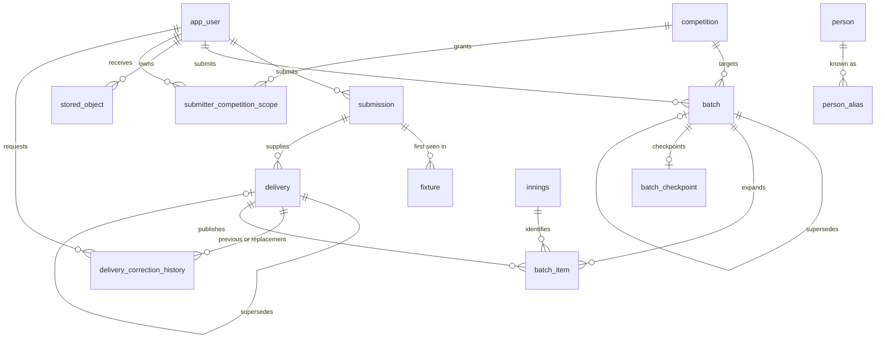
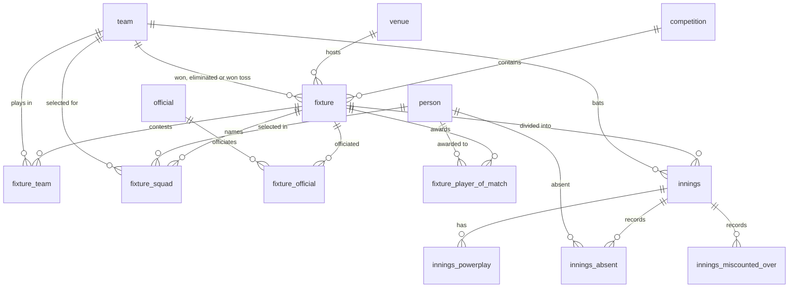
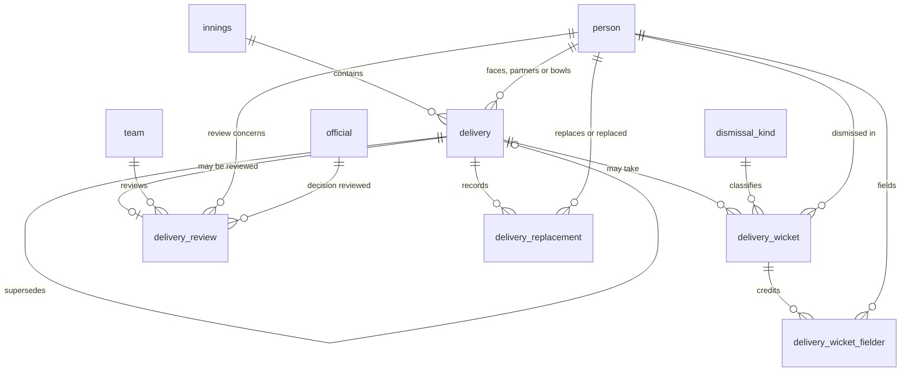

# Entity relationship diagram

The diagrams show the core sport, identity and provenance relationships from the migrated schema.
`apps/backend/scripts/queries/erd.sql` is the repeatable query for the complete live foreign-key
inventory; the ordered SQL under `database/migrations/` remains authoritative for exact tables,
columns, constraints and indexes. Column and event-identity detail is in [the event model](schema.md),
and the [Database architecture guide](guide.md) explains how the detailed pages fit together.

## Provenance and identity

Every fixture and every delivery carries the submission it arrived in. Application accounts are
mapped to their managed-auth provider subject and receive only explicit server-owned competition
grants. A person is identified by their registry reference; the names they have appeared under are
kept separately and are never a join key.

Deleting an account tombstones `app_user` in place. The `submission.submitted_by` relationship is
retained and does not cascade; only the account's competition-scope rows are removed.

A batch retains its submitter, target competition and original object identity. Its items point to
the innings natural key before publication and to the resulting delivery revision afterwards. That
delivery continues to point to `submission`, so batch publication extends the existing provenance
chain rather than introducing a second published-event model. Batch and batch-item rows are
append-only provenance records and cannot be deleted; a replacement is represented by the
self-reference instead.

The competition and innings foreign keys are populated only after human-facing or namespaced source
references have resolved; submitters do not enter these database keys. Unresolved source rows remain
associated with their batch through a downstream source-issue model rather than placeholder foreign
keys. The batch source URI is an opaque application reference resolved through the private object
store, not a public Azure location.

`stored_object` permanently records the owner, sanitised original filename, media type, byte count,
SHA-256 checksum, server-generated provider key, provider version and retention state for private
payload bytes. Expiry changes its lifecycle state and deletes only the provider bytes; the metadata
row cannot be deleted. Batch receipts store the opaque application object identity in
`batch.source_uri`, not the provider key.

## Match structure

A fixture holds any number of innings rather than two; a super over adds a third
and fourth. Officials are separate from persons because the source gives them no
stable identifier.

## Events

The delivery is the event. A correction inserts a new row with an explicit predecessor, marks the prior
row superseded, and appends an immutable `delivery_correction_history` record containing actor, time,
reason, before/after states, and source provenance. All derivation reads `delivery_current`, the view of rows
not yet superseded. Reviewer identity, decision, time and reason are retained together where review applies.

## AI Declaration

The preceding document was generated with the assistance of Claude-Web[Claude Opus 5]. The
application-account scope relationships and source-file cleanup were updated with the assistance of
Codex[GPT-5.6 Sol]. The issue #276 batch relationships were added with the assistance of Codex[GPT-5].
The issue #356 reference-resolution boundary was documented with the assistance of Codex[GPT-5].
The issue #358 stored-object provenance relationship was added with the assistance of Codex[GPT-5].
The issue #284 correction lineage and audit relationships were added with the assistance of Codex[GPT-5].
