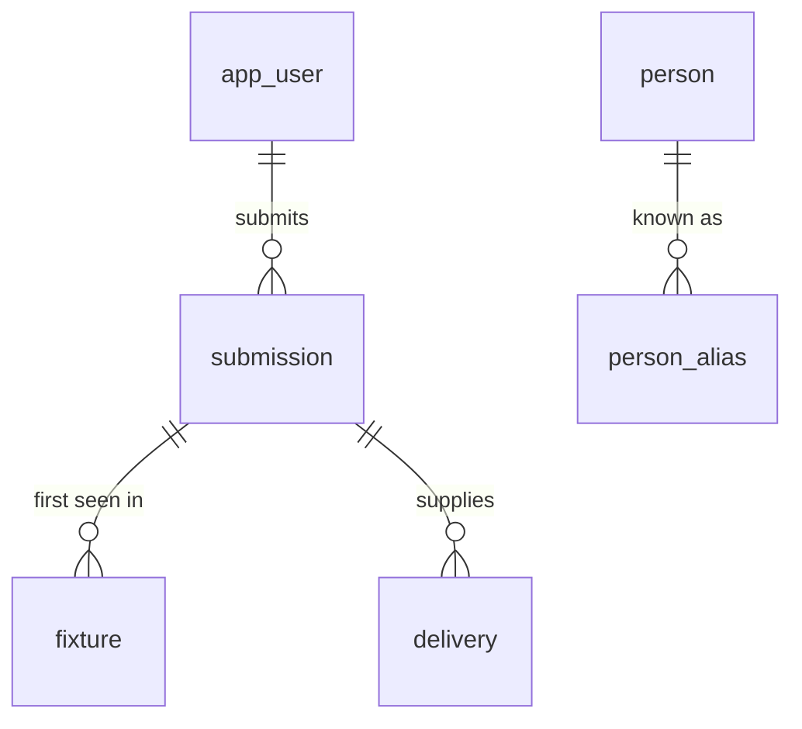
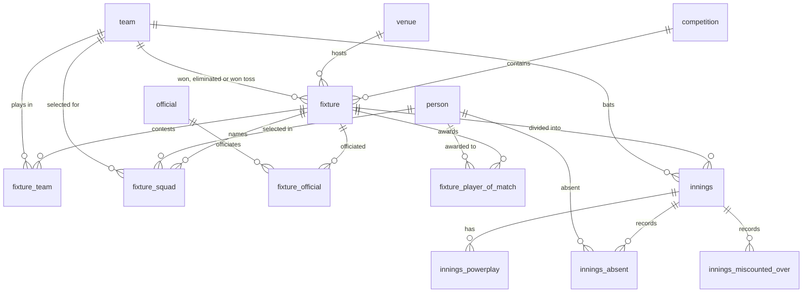
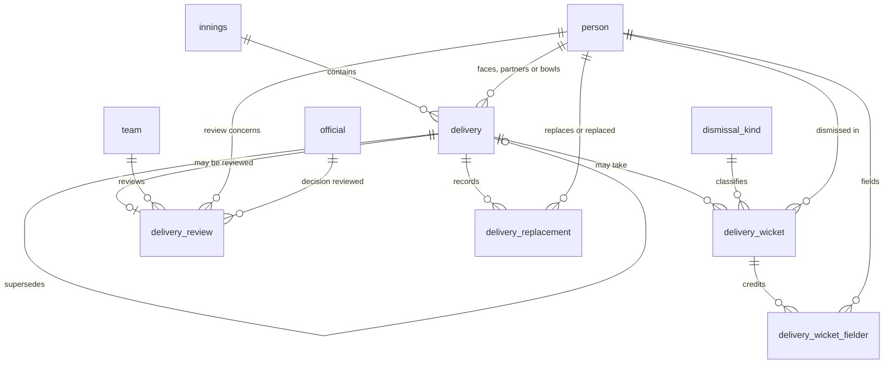

@'
# Entity relationship diagram

The relationships below were read from the database with
`apps/backend/scripts/queries/erd.sql`, which lists every foreign key in the
`public` schema. The diagram is therefore a description of the schema as
migrated, not a separate design document. Column detail is in
[the event model](schema.md).

## Provenance and identity

Every fixture and every delivery carries the submission it arrived in. A person
is identified by their registry reference; the names they have appeared under are
kept separately and are never a join key.

## Match structure

A fixture holds any number of innings rather than two; a super over adds a third
and fourth. Officials are separate from persons because the source gives them no
stable identifier.

## Events

The delivery is the event. A correction inserts a new row and marks the prior one
superseded through `superseded_by`, so the relationship from delivery to delivery
is the correction history. All derivation reads `delivery_current`, the view of
rows not yet superseded.

## AI Declaration

The preceding document was generated with the assistance of Claude-Web[Claude Opus 5].
'@ | Set-Content -Path docs\database\erd.md -Encoding utf8