# Information architecture, user journeys and responsive wireframes

**Issue:** #56

> This document defines the navigation structure, the main user journeys, and low-fidelity
> responsive wireframes for Stat'sTheGame. It covers presentation and flow only; it does not
> change the access model, the event/statistic domain, or the API contract, and it must stay
> consistent with the approved [brand and interface guidelines](brand-guidelines.md). Wireframes
> are intentionally low-fidelity (structure and content, not final visual styling) so the team can
> review flow and states before detailed page implementation begins.

---

## 1. Scope and audiences

Four audiences use the same application, distinguished by `app_user.application_role` and,
for submitters, `submitter_competition_scope` (see
[Roles and permissions](../security/roles-and-permissions.md)):

| Audience               | Sign-in required | Role                                         |
| ---------------------- | ---------------- | -------------------------------------------- |
| **Public visitor**     | No               | Unauthenticated                              |
| **Signed-in viewer**   | Yes              | `viewer` (default for any new account)       |
| **Approved submitter** | Yes              | `submitter`, scoped to specific competitions |
| **Administrator**      | Yes              | `admin`                                      |

The frontend may use role/scope to decide what to show, but — consistent with the security
boundary in the roles document — **frontend visibility is never the security boundary**; every
wireframe below assumes the backend re-checks role and scope on every request.

---

## 2. Information architecture

### 2.1 Site map

All routes below exist today in `apps/frontend/src/App.tsx`. Public browsing routes require no
session; `/submissions/new` requires `submitter`/`admin`; `/admin/users` requires `admin`.

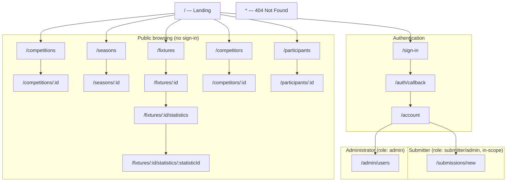

### 2.2 Navigation rules

- The global header exposes the same public browsing links (Competitions, Seasons, Fixtures,
  Competitors, Participants) to every audience, signed in or not — public statistics must remain
  reachable without an account.
- The header shows **Sign in** for an unauthenticated visitor, and **Account** (leading to
  `/account`) once authenticated.
- **Submit events** appears in account-area navigation only for `submitter`/`admin` roles, and
  only once the account's scope has been confirmed by the backend (the page itself still checks
  independently — see §3.3).
- **Manage users** appears in account-area navigation only for `admin`.
- Deep links to any public detail page (`/fixtures/:id`, `/participants/:id`, etc.) work directly,
  without first visiting the list page, since these are the URLs likely to be shared or indexed.
- An unknown path, or a public ID that does not resolve, renders the shared 404 page rather than
  redirecting silently.

### 2.3 Content hierarchy per page type

| Page type                  | Hierarchy                                                                                   |
| -------------------------- | ------------------------------------------------------------------------------------------- |
| List page (e.g. Fixtures)  | Page title → filters → paginated card/row grid → pagination                                 |
| Detail page (e.g. Fixture) | Breadcrumb → title/summary → tabs (Overview / Statistics / Squads / Timeline) → tab content |
| Form page (Submission)     | Title → scope/help copy → single-column form → primary action → result region               |
| Admin page                 | Title → one card per account → request state → scope controls → role-transition actions     |

---

## 3. User journeys

### 3.1 Public visitor — browse fixtures, events and statistics without an account

Confirms the acceptance criterion that public fixture, event and statistic pages are reachable
without sign-in.

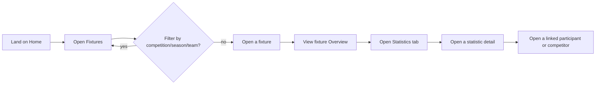

- No step in this journey requires authentication; **Sign in** remains visible but is never
  forced.
- Every list and detail page independently handles its own loading, empty and error states (§4),
  since the visitor may deep-link directly into any page.

### 3.2 Signed-in viewer — request submitter access

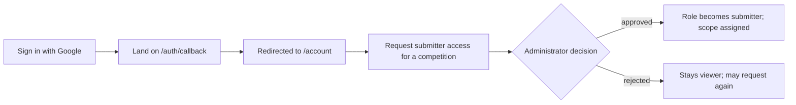

- Authentication is Supabase Auth with Google OAuth (per
  [System architecture](../architecture/system-architecture.md)); the frontend never assigns a
  role itself.
- A pending request is visible on the account page as "Pending review"; the account remains a
  `viewer` — and therefore cannot submit — until an administrator approves it.

### 3.3 Approved submitter — submit delivery events for a fixture

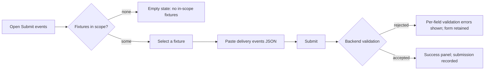

- The fixture list shown is only what the backend returns as in-scope for that account — the
  frontend does not compute scope itself.
- Final statistic totals are never entered directly; they are always derived from accepted
  events, consistent with the event-sourced design in the
  [system architecture](../architecture/system-architecture.md).
- On rejection, focus moves to the result heading and every field-level reason is listed, so the
  submitter can correct and resubmit without losing their pasted JSON.

### 3.4 Administrator — approve, reject or revoke submitter access

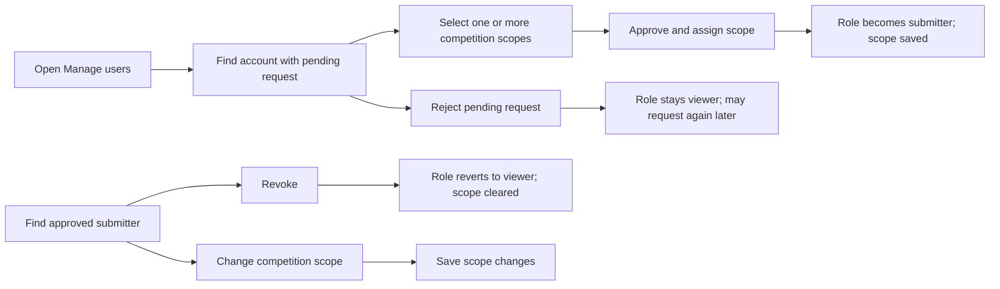

- Approval and scope assignment happen as one action; approval is blocked until at least one
  scope is selected (§4 validation states).
- Rejection, revocation and scope changes are separate, permitted only for the lifecycle states
  the backend allows (pending → approved/rejected; approved → revoked/rescoped) — an
  administrator cannot approve their own account or an already-admin account.
- Every transition is visible immediately in the account's card; no page reload is required.

---

## 4. States considered per page

Every list, detail, form and admin page in this document is designed against the same four
states, shown as annotated strips beneath each wireframe in §5:

| State          | Pattern used across pages                                                                                                                                                                                                  |
| -------------- | -------------------------------------------------------------------------------------------------------------------------------------------------------------------------------------------------------------------------- |
| **Loading**    | Skeleton/placeholder content in place, with a status-role announcement (e.g. "Loading fixture…", "Checking submission access") for assistive technology.                                                                   |
| **Empty**      | A specific, non-alarming message naming what is absent (e.g. "No published fixtures match the current filters.", "No in-scope fixtures.") rather than a generic blank page.                                                |
| **Validation** | Errors surface next to the offending field where the field is identifiable, plus a summary region that receives focus (submission and admin-approval forms).                                                               |
| **Error**      | An alert-role message distinct from "empty" (e.g. failed fetch vs. genuinely no data), with a retry action where the failure is retryable. Unresolvable public IDs render the shared 404 page rather than an error banner. |

---

## 5. Responsive wireframes

Wireframes are intentionally low-fidelity (structure, hierarchy and states — not final visual
styling, which is governed by the [brand and interface guidelines](brand-guidelines.md)). Desktop
frames are shown at a 1280px reference width; mobile frames at a 375px reference width. Source
SVGs are stored in `docs/design/assets/wireframes/` and can be reopened and edited directly.

### 5.1 Home (public)

Landing page — static hero and principles content; no data fetch, so no loading state applies.

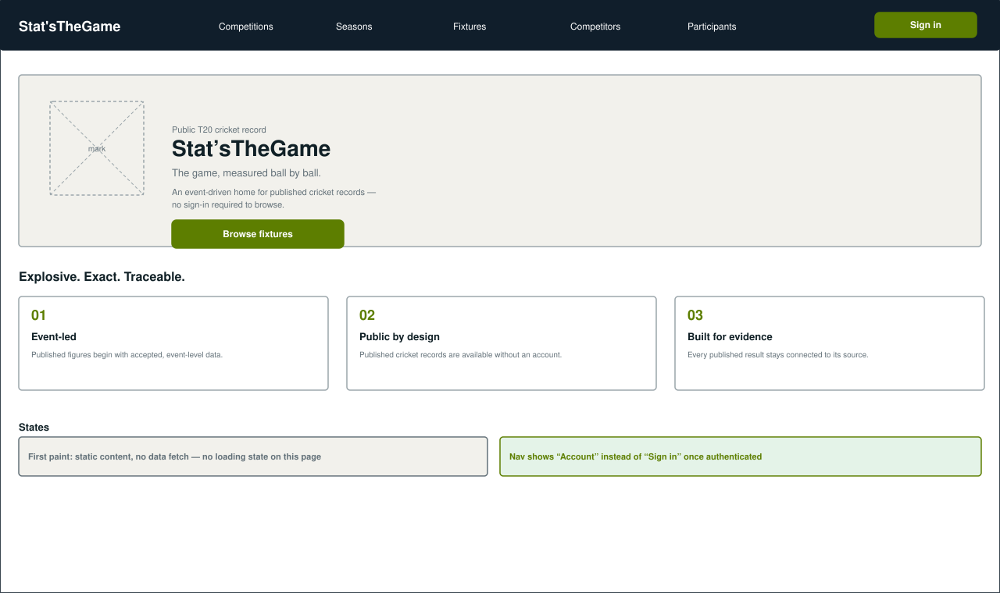
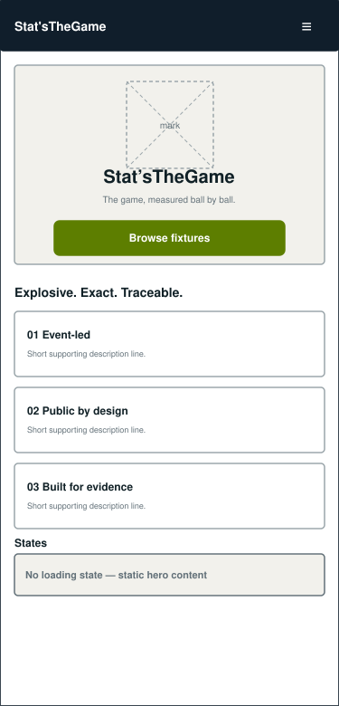

### 5.2 Fixtures (public list)

Filterable list of published fixtures. Available without sign-in.

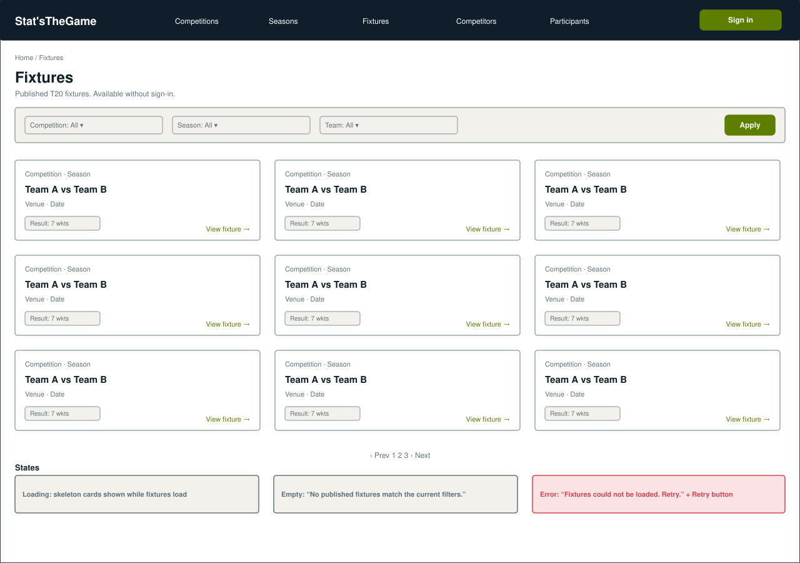
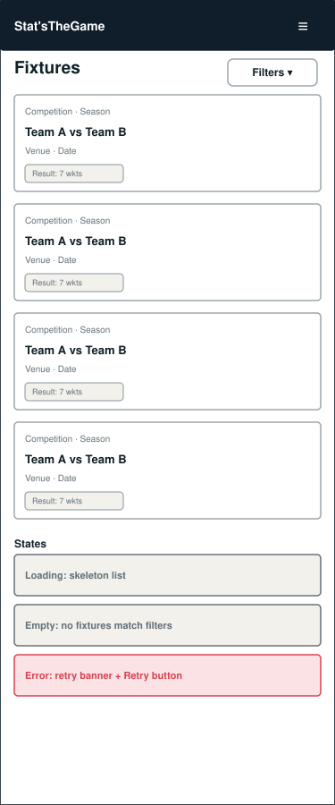

### 5.3 Fixture detail and statistics (public detail)

Tabbed detail page; the Statistics tab is what published event-derived statistics roll up into.

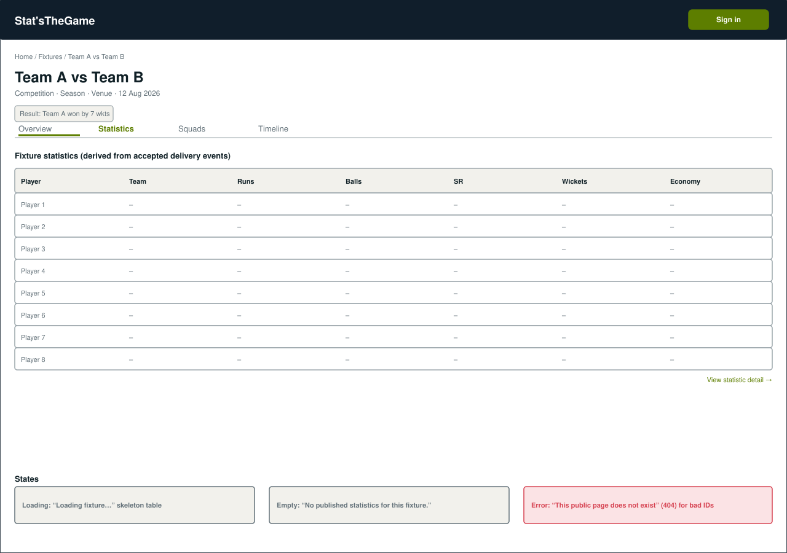
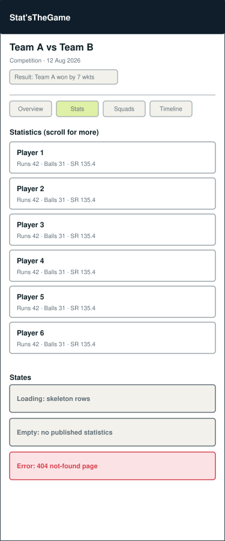

### 5.4 Sign in

Single sign-in method (Google, via Supabase Auth), reached from any page's header.

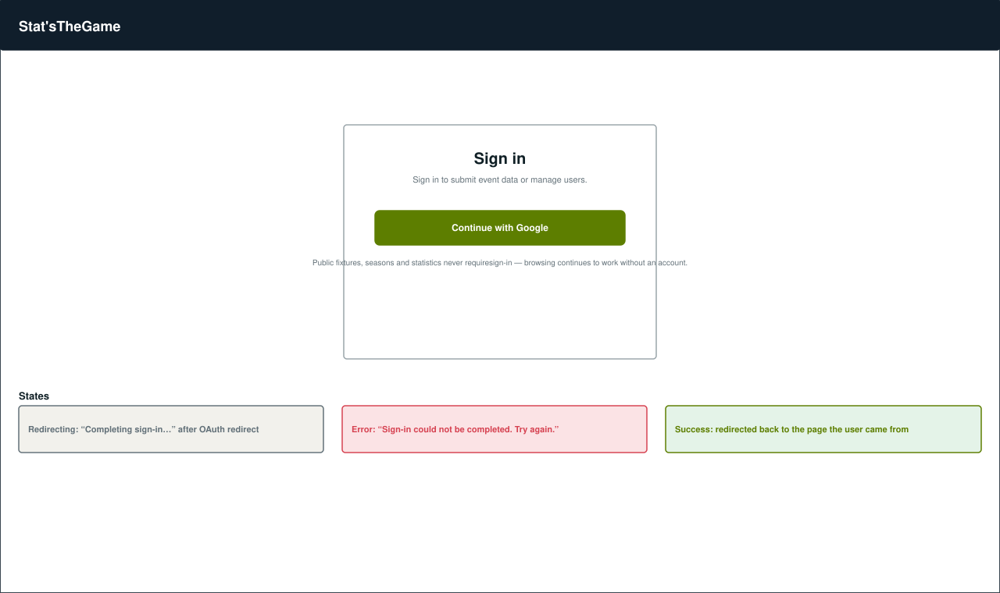
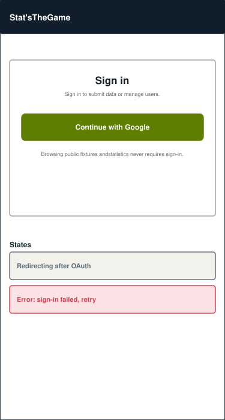

### 5.5 Submit delivery events (submitter)

Single-column form restricted to fixtures within the account's confirmed scope.

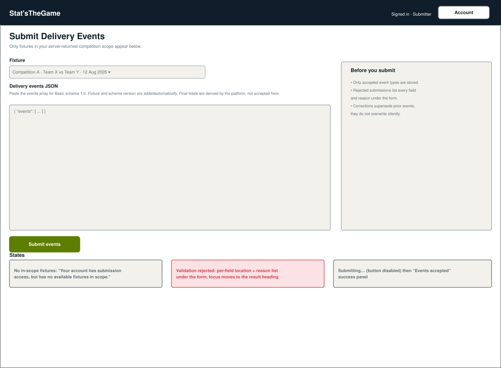
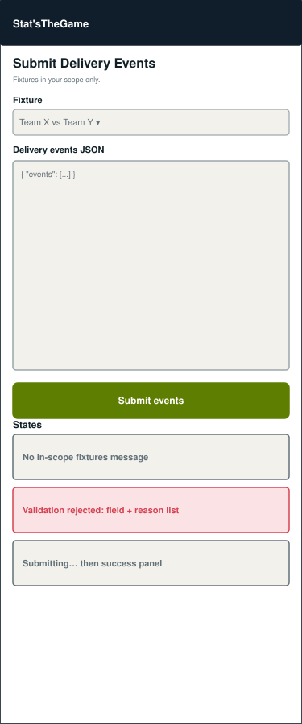

### 5.6 Manage users (administrator)

One card per account; scope selection and role-transition actions gated by current lifecycle
state.

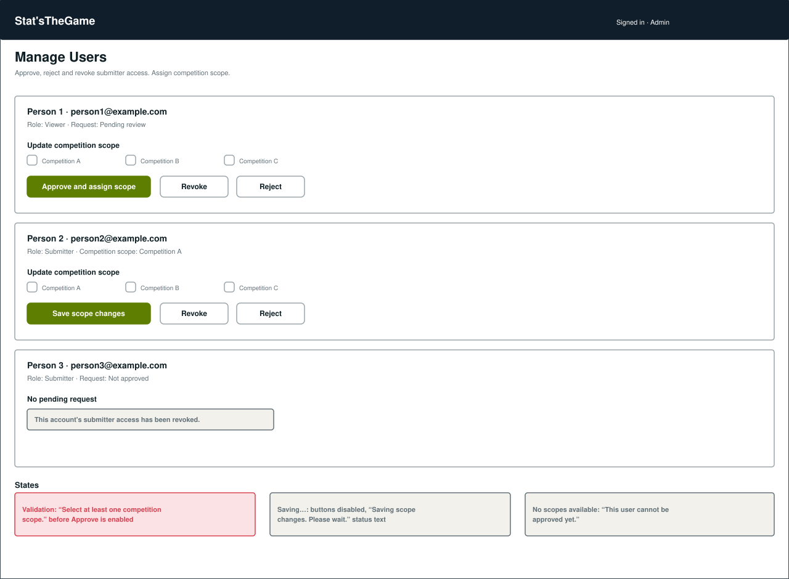
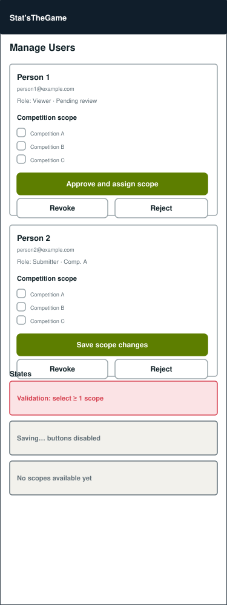

---

## 6. Open questions for review

- Should the public site expose a global search across fixtures/competitors/participants, or is
  filtered browsing on each list page sufficient for the current scope?
- Does the account page need a visible history of past submissions, or is that deferred to a
  later issue?
- Confirm pagination style (numbered pages vs. "load more") for large public lists before
  implementation.

## 7. Review and sign-off

| Reviewer | Decision | Date | Notes |
| -------- | -------- | ---- | ----- |
|          |          |      |       |

This document is merged through the Pull Request referenced by `Closes #56`, per the project's
git methodology. Detailed page implementation should not begin until this document has been
reviewed by the team, per the acceptance criteria on #56.
