# Final design: information architecture, journeys and wireframes

**Issues:** #56 (original design), #581 (navigation restructure), #894 (final alignment)
**Status:** Final — describes the implemented product at Milestone 4 submission.

!!! info "Final design, not a plan"

    Everything on this page before [§8 Design evolution](#8-design-evolution-and-traceability) describes what the application does
    now. Routes and labels are checked against the frontend source by
    `tests/deployment/final-design-documentation.test.mjs` (run by `npm run test:deployment`), so
    the page fails CI if it drifts from the implementation. The superseded Sprint 1 wireframes are
    preserved as historical evidence in
    [`evidence/design/legacy-wireframes/`](https://sdp.ms.wits.ac.za/git-push-pray/Sport-Analytics-Tool/src/branch/main/evidence/design/legacy-wireframes/README.md){ target="_blank" rel="noopener" }
    and are not part of this design.

Visual identity is governed by the [brand guidelines](brand-guidelines.md) and implementation
conventions by the [frontend component baseline](frontend-component-baseline.md). This page owns
structure and flow only; it does not change the access model, the event/statistic domain or the API
contract.

---

## 1. Audiences and role-specific areas

One application serves every audience. Roles come from `app_user.application_role` and, for
submitters, `submitter_competition_scope` (see [Roles and permissions](../security/roles-and-permissions.md)).
**Frontend visibility is never the security boundary**; the backend re-checks role and scope on every
request.

| Audience               | Sign-in | Role and scope                                | Areas they see                                                                     |
| ---------------------- | ------- | --------------------------------------------- | ---------------------------------------------------------------------------------- |
| **Public visitor**     | No      | Unauthenticated                               | Home, Explore Data, statistics, Compare players, Downloads, API Explorer, policies |
| **Signed-in viewer**   | Yes     | `viewer` (default for every new account)      | Public areas, **Pinned** shortcuts, Account                                        |
| **Approved submitter** | Yes     | `submitter`, limited to approved competitions | Viewer areas plus **Manage Submission**: Submit data, My submissions               |
| **Administrator**      | Yes     | `admin`                                       | Submitter areas plus **Review** and **Administration**                             |
| **API consumer**       | Key     | Consumer key approved by an administrator     | `/api/v1/consumer/*` endpoints; onboarding from API Explorer and Account           |

There is **no separate reviewer role**: batch review is an administrator workflow inside Manage
Submission.

---

## 2. Information architecture

### 2.1 Site map

Every implemented frontend route is shown. Concrete paths under `/account/` are the four sections of
`/account/:section`.

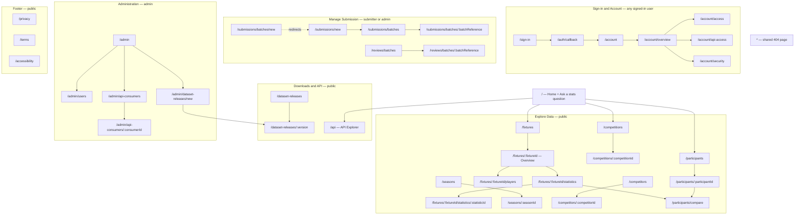
```mermaid
flowchart TD
    Home["/ — Home + Ask a stats question"]

    subgraph Explore["Explore Data — public"]
        Fixtures["/fixtures"] --> FixtureDetail["/fixtures/:fixtureId — Overview"]
        FixtureDetail --> FixtureStats["/fixtures/:fixtureId/statistics"]
        FixtureDetail --> FixturePlayers["/fixtures/:fixtureId/players"]
        FixtureStats --> StatDetail["/fixtures/:fixtureId/statistics/:statisticId"]
        Competitions["/competitions"] --> CompetitionDetail["/competitions/:competitionId"]
        Seasons["/seasons"] --> SeasonDetail["/seasons/:seasonId"]
        Teams["/competitors"] --> TeamDetail["/competitors/:competitorId"]
        Players["/participants"] --> PlayerDetail["/participants/:participantId"]
        Compare["/participants/compare"]
    end

    subgraph PublicData["Downloads and API — public"]
        Releases["/dataset-releases"] --> ReleaseDetail["/dataset-releases/:version"]
        Api["/api — API Explorer"]
    end

    subgraph Auth["Sign-in and Account — any signed-in user"]
        SignIn["/sign-in"] --> Callback["/auth/callback"]
        Callback --> AccountRedirect["/account"]
        AccountRedirect --> Overview["/account/overview"]
        Overview --> Access["/account/access"]
        Overview --> ApiAccess["/account/api-access"]
        Overview --> Security["/account/security"]
    end

    subgraph Manage["Manage Submission — submitter or admin"]
        Submit["/submissions/new"]
        LegacyUpload["/submissions/batches/new"] -. redirects .-> Submit
        Submit --> History["/submissions/batches"]
        History --> Report["/submissions/batches/:batchReference"]
        ReviewQueue["/reviews/batches"] --> ReviewDetail["/reviews/batches/:batchReference"]
    end

    subgraph Admin["Administration — admin"]
        AdminHub["/admin"] --> AdminUsers["/admin/users"]
        AdminHub --> Consumers["/admin/api-consumers"] --> ConsumerDetail["/admin/api-consumers/:consumerId"]
        AdminHub --> Publish["/admin/dataset-releases/new"]
    end

    subgraph Footer["Footer — public"]
        Privacy["/privacy"]
        Terms["/terms"]
        Accessibility["/accessibility"]
    end

    Home --> Fixtures
    Home --> Competitions
    Home --> Players
    Home --> Api
    FixtureStats --> Compare
    PlayerDetail --> Compare
    Publish --> ReleaseDetail
    NotFound["* — shared 404 page"]
```

### 2.2 Primary navigation

| Location         | Item                     | Destinations                                                                                                                     | Shown to                                  |
| ---------------- | ------------------------ | -------------------------------------------------------------------------------------------------------------------------------- | ----------------------------------------- |
| Header (records) | **Explore Data** menu    | Fixtures, Competitions, Seasons, Teams (`/competitors`), Players (`/participants`)                                               | Everyone                                  |
|                  | **Pinned** menu          | `Team: …` / `League: …` shortcuts pinned from team and competition pages                                                         | Signed-in users who have pinned something |
|                  | **Downloads**            | Dataset releases catalogue (`/dataset-releases`) with download and verify detail                                                 | Everyone                                  |
|                  | **API**                  | `/api` API Explorer                                                                                                              | Everyone                                  |
| Header (account) | **Sign in**              | `/sign-in`                                                                                                                       | Signed-out visitors                       |
|                  | **Manage Submission**    | Submitter: Submit data, My submissions, Access & scope. Admin: Submit data, Submission history, Review                           | Submitters and administrators             |
|                  | **Administration**       | `/admin` hub                                                                                                                     | Administrators                            |
|                  | **Manage account**       | `/account/overview`                                                                                                              | Signed-in users                           |
| Header           | Theme control            | Day Match / Night Match                                                                                                          | Everyone                                  |
| Footer           | Footer navigation        | API Explorer, API Documentation (docs site), Privacy Notice, Terms of Use, Accessibility                                         | Everyone                                  |
| Page level       | Local section navigation | Fixture: Overview, Statistics, Players. Account: Overview, Access, API access, Account management. Review: Needs review, History | Per page                                  |

Navigation rules:

- The header stays stable before and after sign-in; role items are added, never rearranged.
- Mobile uses a **Menu** button that opens labelled sections — Public, Manage Submission,
  Administration, Pinned and Account — with text links rather than icon-only items.
- Protected deep links carry a validated internal return path through sign-in; external and
  protocol-relative return targets are rejected.
- Every public detail URL works as a direct deep link. An unknown path, or a public ID that does not
  resolve, renders the shared 404 page.
- `/account` redirects to `/account/overview`; the retired `/submissions/batches/new` upload URL
  redirects to `/submissions/new`.

### 2.3 Page hierarchy by page type

| Page type                      | Hierarchy                                                                                                    |
| ------------------------------ | ------------------------------------------------------------------------------------------------------------ |
| Home                           | Hero → Ask a stats question → principles → delivery-to-statistic story → Explore gateway → API feature → CTA |
| List (Fixtures, Players, …)    | Eyebrow + title → readable searchable filters → result count → card/row list → Previous/Next pagination      |
| Detail (fixture, team, player) | Breadcrumbs → title + key facts → local section navigation → sections → related collections                  |
| Statistics                     | Breadcrumbs → Match statistics → summary cards → innings/extras/powerplay → leaders → scorecards → notices   |
| Form (Submit data, publish)    | Access check → title + scope help → choice of workflow → single-column form → primary action → result region |
| Workspace (Review)             | Title → Needs review / History → batch list → batch detail sections → Review decision                        |
| Administration                 | Hub of three areas → list/create view → detail view with explicit confirmation for destructive actions       |
| API Explorer                   | Major version + resources → How to access the API → implementation status → interactive explorer             |

Competition and season detail pages add scoped statistics leaderboards; team and competition pages
offer a **Pin** shortcut; player detail shows career totals and match history with a **Compare
players** link; fixture Overview shows match facts and contextual weather.

---

## 3. Major user journeys

### 3.1 Public visitor — discover a fixture, its statistics and the source events

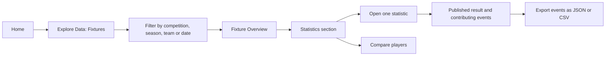
```mermaid
flowchart LR
    A[Home] --> B[Explore Data: Fixtures]
    B --> C[Filter by competition, season, team or date]
    C --> D[Fixture Overview]
    D --> E[Statistics section]
    E --> F[Open one statistic]
    F --> G[Published result and contributing events]
    G --> H[Export events as JSON or CSV]
    E --> I[Compare players]
```

No step requires sign-in. Every list and detail page owns its loading, empty and error states (§4)
because a visitor may deep-link into any of them.

### 3.2 Public visitor — Ask a stats question

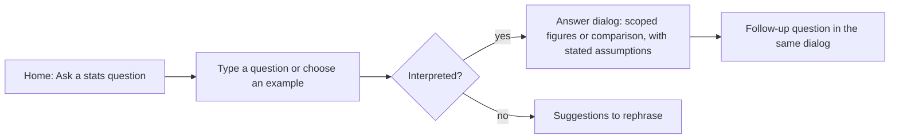
```mermaid
flowchart LR
    A[Home: Ask a stats question] --> B[Type a question or choose an example]
    B --> C{Interpreted?}
    C -- yes --> D[Answer dialog: scoped figures or comparison, with stated assumptions]
    C -- no --> E[Suggestions to rephrase]
    D --> F[Follow-up question in the same dialog]
```

Answers are computed from published aggregates through `POST /api/v1/natural-language-queries`; the
dialog shows the scope it assumed rather than presenting a guess as fact.

### 3.3 Signed-in user — account, submitter access and API access

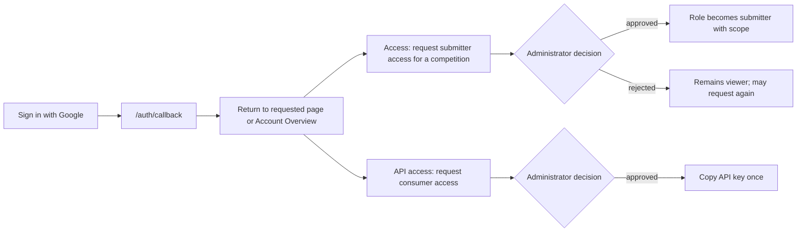
```mermaid
flowchart LR
    A[Sign in with Google] --> B["/auth/callback"]
    B --> C[Return to requested page or Account Overview]
    C --> D[Access: request submitter access for a competition]
    D --> E{Administrator decision}
    E -- approved --> F[Role becomes submitter with scope]
    E -- rejected --> G[Remains viewer; may request again]
    C --> H[API access: request consumer access]
    H --> I{Administrator decision}
    I -- approved --> J[Copy API key once]
```

Approved competition scopes are visible from Account Overview; Account management holds sign-out and
confirmed account deletion.

### 3.4 Approved submitter — submit fixture, season or back-catalogue data

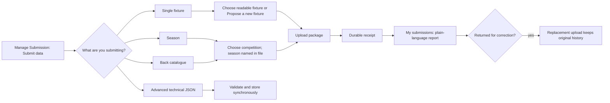
```mermaid
flowchart LR
    A[Manage Submission: Submit data] --> B{What are you submitting?}
    B --> C[Single fixture]
    B --> D[Season]
    B --> E[Back catalogue]
    B --> F[Advanced technical JSON]
    C --> G[Choose readable fixture or Propose a new fixture]
    D --> H[Choose competition; season named in file]
    E --> H
    G --> I[Upload package]
    H --> I
    I --> J[Durable receipt]
    J --> K[My submissions: plain-language report]
    K --> L{Returned for correction?}
    L -- yes --> M[Replacement upload keeps original history]
    F --> N[Validate and store synchronously]
```

- Choices are limited to the backend-owned scope; selectors are searchable and show dates and team
  names, not database IDs.
- Single fixture accepts JSON or CSV; Season and Back catalogue also accept NDJSON. Limits (50 MB,
  50,000 events) and templates precede the file control.
- Background processing does not depend on the page staying open. Validation failures name readable
  fields; rule codes stay in collapsed **Technical details**.
- Final statistic totals are never entered; they are derived from accepted events.

### 3.5 Administrator — review a batch

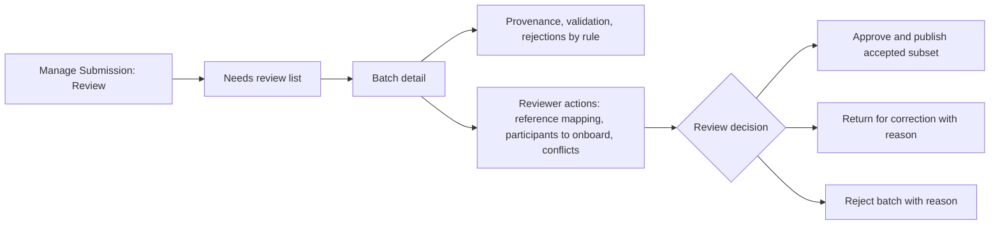
```mermaid
flowchart LR
    A[Manage Submission: Review] --> B[Needs review list]
    B --> C[Batch detail]
    C --> D[Provenance, validation, rejections by rule]
    C --> E[Reviewer actions: reference mapping, participants to onboard, conflicts]
    E --> F{Review decision}
    F --> G[Approve and publish accepted subset]
    F --> H[Return for correction with reason]
    F --> I[Reject batch with reason]
```

### 3.6 Administrator — users, API consumers and dataset releases

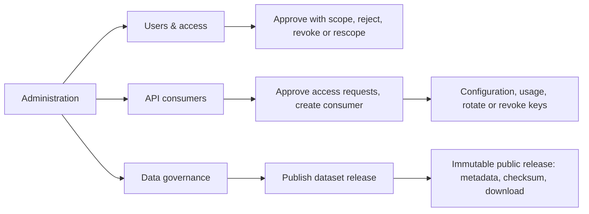
```mermaid
flowchart LR
    A[Administration] --> B[Users & access]
    B --> B1[Approve with scope, reject, revoke or rescope]
    A --> C[API consumers]
    C --> C1[Approve access requests, create consumer]
    C1 --> C2[Configuration, usage, rotate or revoke keys]
    A --> D[Data governance]
    D --> D1[Publish dataset release]
    D1 --> D2[Immutable public release: metadata, checksum, download]
```

Approval requires at least one competition scope; an administrator cannot approve their own account.
Raw API keys are shown once in memory and disappear when dismissed. A release version cannot be
reused; corrections need a new version.

### 3.7 API consumer — from explorer to keyed requests

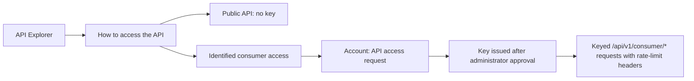
```mermaid
flowchart LR
    A[API Explorer] --> B[How to access the API]
    B --> C[Public API: no key]
    B --> D[Identified consumer access]
    D --> E[Account: API access request]
    E --> F[Key issued after administrator approval]
    F --> G["Keyed /api/v1/consumer/* requests with rate-limit headers"]
```

---

## 4. Page states

| State          | Pattern used across pages                                                                                                              |
| -------------- | -------------------------------------------------------------------------------------------------------------------------------------- |
| **Loading**    | Structure renders immediately with a status-role message (e.g. "Loading fixture…", "Checking administrator access").                   |
| **Empty**      | A specific message naming what is absent (e.g. "No dataset releases are available") rather than a blank page.                          |
| **Validation** | Errors next to the field where identifiable plus a summary that receives focus; entered values are retained.                           |
| **Error**      | An alert distinct from "empty", with retry where the failure is retryable. Unresolvable public IDs render the shared 404 page.         |
| **No access**  | Role-gated pages explain the missing role ("Administrator access required", "Submitter role required"); the backend still enforces it. |
| **Partial**    | Statistics pages label partial or unavailable figures in **Data notices** instead of showing zeros.                                    |

---

## 5. Responsive and accessible behaviour

Implementation detail lives in the [component baseline](frontend-component-baseline.md#shell-and-route-conventions);
the design-level rules are:

- The header moves through **full → compact → menu** tiers by available width, so role links never
  overflow; the mobile menu exposes the same destinations as labelled text links.
- Content stacks into one column before type shrinks; summary cards stack on narrow screens.
- Wide scorecards and data tables scroll horizontally inside their own focusable region, with an edge
  shadow, and the page itself never scrolls sideways at 320 px.
- Route changes move focus to `<main>` and set a page title; every page has one visible `<h1>`.
- Day Match and Night Match themes, visible focus and reduced-motion handling apply to every route.

---

## 6. Final wireframes

These are annotated low-fidelity frames of the **implemented** screens (structure and hierarchy, not
pixel styling). Numbered markers refer to the annotations beneath each frame. Desktop frames use a
1280 px reference width and mobile frames 375 px. Sources are editable SVGs in
`docs/design/assets/final-wireframes/`.

### 6.1 Home

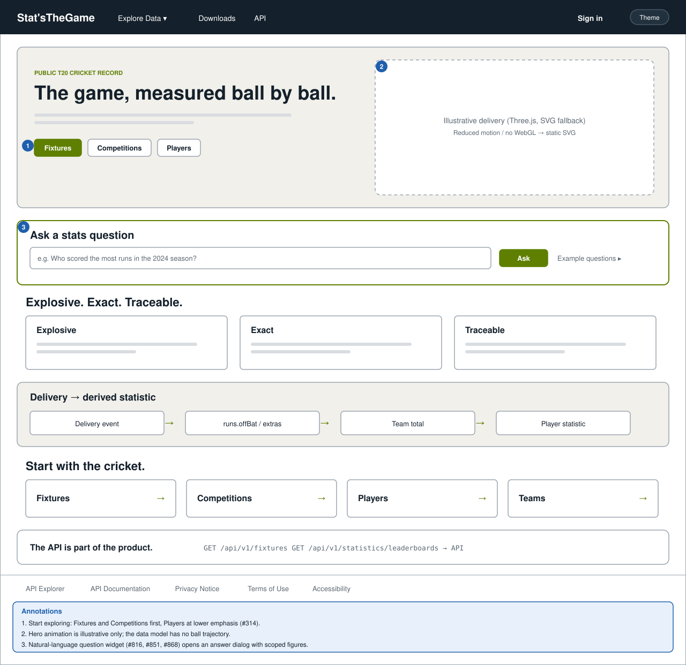

### 6.2 Fixture statistics

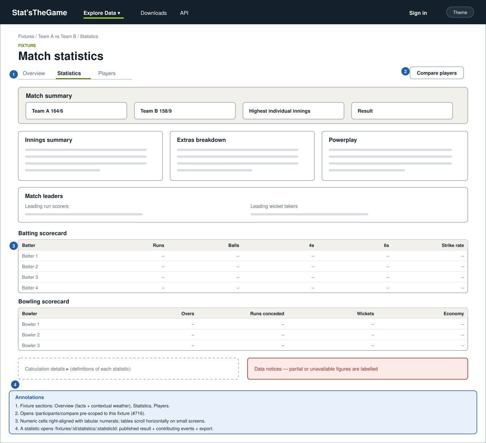

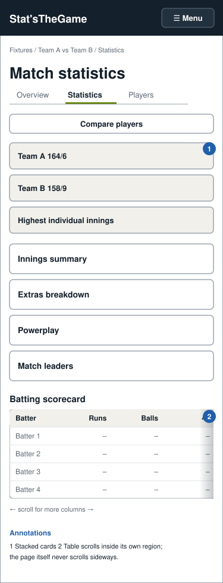{ width="375" }

### 6.3 Compare players

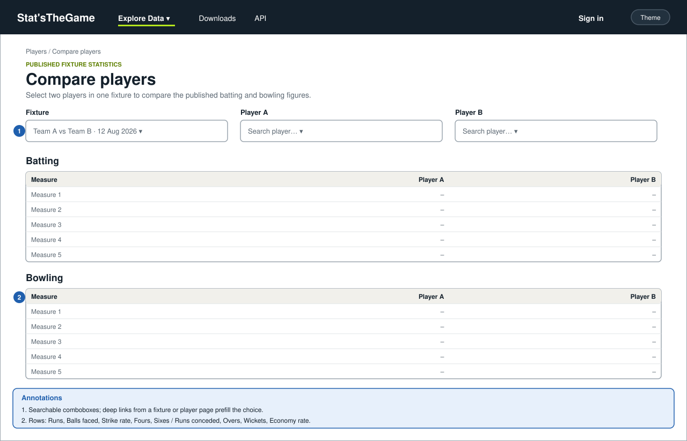

### 6.4 API Explorer

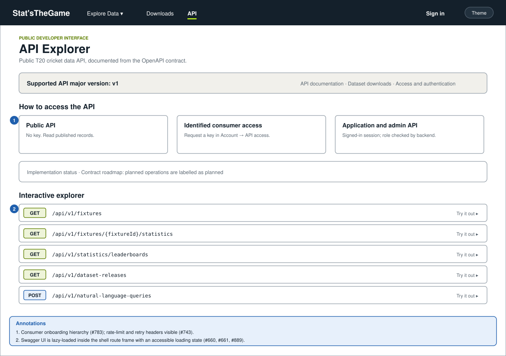

### 6.5 Account and sign-in

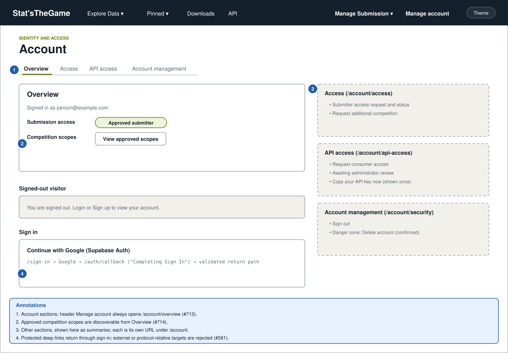

### 6.6 Submit data

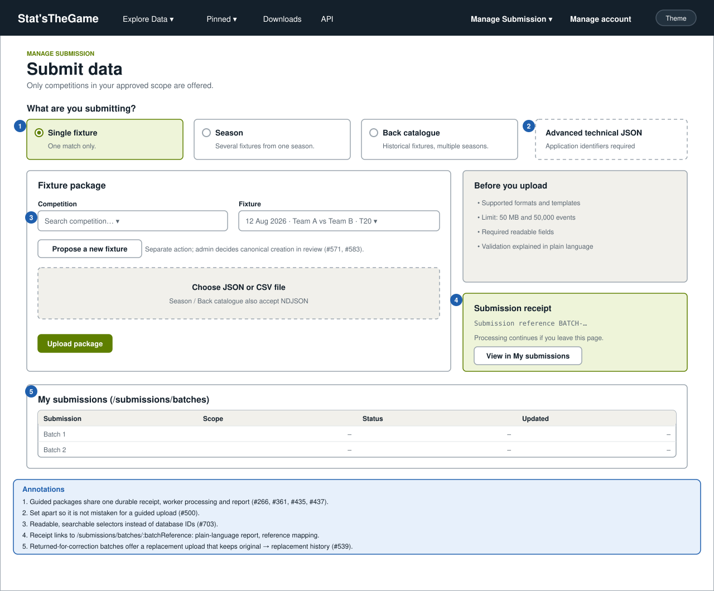

### 6.7 Review workspace

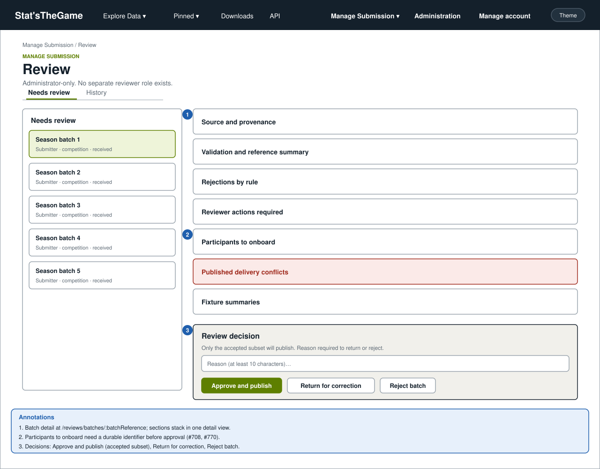

### 6.8 Administration

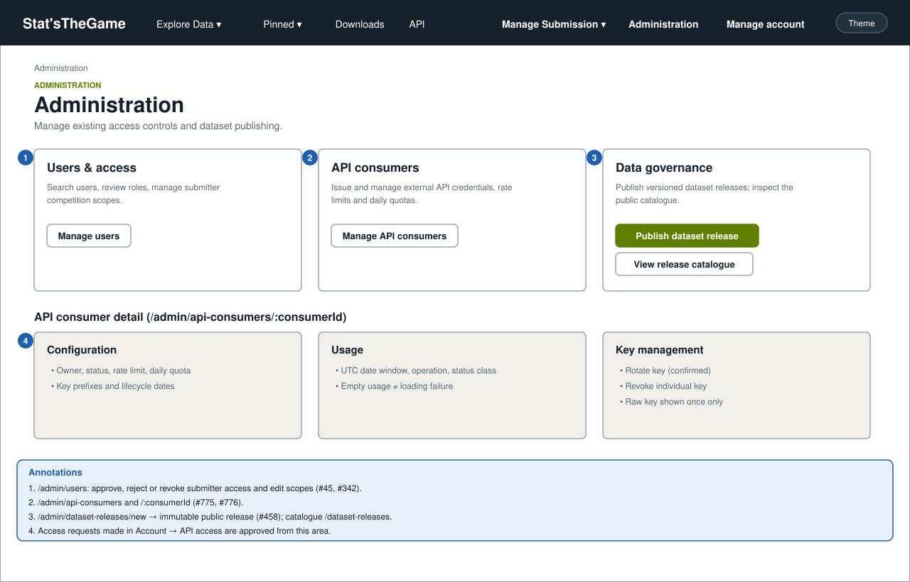

### 6.9 Mobile navigation

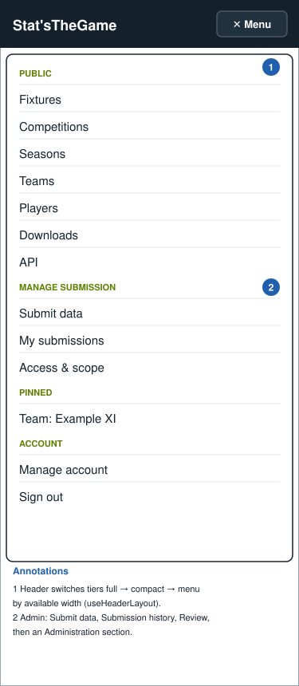{ width="375" }

---

## 7. Related evidence

- [Final frontend UX, accessibility and responsiveness audit](final-frontend-ux-audit.md) (#889)
- [Roles and permissions](../security/roles-and-permissions.md) and
  [Authentication & authorisation](../security/authentication.md)
- [OpenAPI & API Explorer](../api/openapi.md) and [Consumer API access](../api/consumer-keys.md)
- [Stakeholder & user-feedback review](../process/stakeholder-and-user-feedback-review.md)
- [Final system verification bank](../testing/final-system-verification.md)

## 8. Design evolution and traceability

The Sprint 1 design (#56) set the direction: public-first browsing, event-derived statistics and a
small role model. Implementation, stakeholder reviews and formal user testing then reshaped it. The
superseded frames are archived with a per-artefact status in the
[legacy wireframe register](https://sdp.ms.wits.ac.za/git-push-pray/Sport-Analytics-Tool/src/branch/main/evidence/design/legacy-wireframes/README.md){ target="_blank" rel="noopener" }.

| Area                               | Early design (Sprint 1)                                                 | Final implementation                                                                                                    | Driver and evidence                                                                   |
| ---------------------------------- | ----------------------------------------------------------------------- | ----------------------------------------------------------------------------------------------------------------------- | ------------------------------------------------------------------------------------- |
| Navigation                         | Flat header: Competitions, Seasons, Fixtures, Competitors, Participants | Explore Data, Pinned, Downloads and API; separate Manage Submission, Administration and Manage account; mobile Menu     | ADR-007 readable cricket names (#191); restructure #581; pinning #802; P07-F01 → #713 |
| Authentication and roles           | Google sign-in; account page as launcher; reviewer implied              | Google sign-in with safe return paths; Account sections; viewer/submitter/admin only; consumer keys as a separate model | #39, #64, #154, #581; consumer access model #820; P07-F02 scopes → #714               |
| Submission                         | Paste delivery-event JSON for one in-scope fixture                      | Guided Single fixture, Season and Back catalogue; Advanced technical JSON set apart; new-fixture proposals              | #266, #435, #437, #571, #703; Sprint 2 finding "too technical" → #499                 |
| Batch and back-catalogue ingestion | Not in the Sprint 1 design                                              | Durable receipt, background worker, readable reports, reference mapping, correction resubmission, multi-season          | #275, #361, #425, #539, #589                                                          |
| Review and administration          | One Manage users page with approve/reject/revoke                        | Administration hub; batch review workspace with participant onboarding; API consumers; dataset releases                 | #342, #362, #458, #708, #775, #776; P11-F01 → #770                                    |
| Statistics and analytics           | One statistics table in a fixture tab; Squads and Timeline tabs planned | Overview/Statistics/Players; scorecards and leaders; statistic → events with export; leaderboards; Compare players; Ask | #54, #270, #635; P08-F01 → #716; natural-language queries #816, #851, #868            |
| API Explorer                       | Not designed; API visible only in documentation                         | `/api` in the header with consumer onboarding and visible rate-limit/retry headers                                      | #660, #661, #783; P09-F01 → #743                                                      |
| Responsive and accessibility       | Two reference widths and annotated state strips                         | Header tiers, labelled mobile menu, contained table scrolling, focus and title on navigation, automated Axe checks      | #57, #355, #800, #889                                                                 |

Two Sprint 1 ideas were not built: the planned Squads/Timeline fixture tabs (replaced by Players and
statistic-to-event traceability) and the global search left as an open question in #56 (filtered
browsing, Pinned and Ask a stats question cover the need).

Some feedback is accepted but not fully closed. P08-F01 (#716) was implemented after Sprint 3 with no
participant retest. Sprint 4 findings P15-F01 (team context in Compare players) and P15-F03 (short
scorecard scrolling) are linked to #800; its polish merged through #896, but a specific fix and human
retest are not established.

Evidence: [Sprint 2](../testing/user-testing-sprint-2-summary.md),
[Sprint 3](../testing/user-testing-sprint-3-summary.md) and
[Sprint 4](../testing/user-testing-sprint-4-summary.md) user-testing summaries;
[stakeholder & user-feedback review](../process/stakeholder-and-user-feedback-review.md);
[ADR-007 public information architecture](https://sdp.ms.wits.ac.za/git-push-pray/Sport-Analytics-Tool/src/branch/main/evidence/decisions/ADR-007-public-information-architecture.md){ target="_blank" rel="noopener" }.

## AI Declaration

The original issue #56 information architecture, journeys and wireframes were produced with the
assistance of Claude.ai[Claude Sonnet 5].
The issue #266 guided file-submission interface was documented with the assistance of Codex[GPT-5].
The issue #314 homepage narrative, illustrative-trajectory constraint and progressive fallback were
documented with the assistance of Codex[GPT-5.6 Sol].
The issue #361 guided batch-upload workflow was documented with the assistance of Codex[GPT-5].
The issue #435 guided single-fixture upload alignment was documented with the assistance of
Codex[GPT-5].
The issue #437 unified submission workflow was documented with the assistance of Codex[GPT-5].
The issue #458 administrator dataset-release workflow was documented with the assistance of
Codex[GPT-5.6 Sol].
The issue #499 plain-language submission validation guidance was documented with the assistance of
ChatGPT-Web[GPT-5.6 Sol].
The issue #539 correction-resubmission journey was documented with the assistance of Codex[GPT-5].
The issue #571 new-fixture proposal journey and its issue #583 duplicate-warning refinement were
documented with the assistance of Codex[GPT-5].
The issue #581 navigation, Account/Manage Submission separation, local navigation and safe authentication
return-path implementation were documented with the assistance of Codex[GPT-5.6 Sol].
The issue #775 administrator API-consumer information architecture was documented with the
assistance of Codex[GPT-5.6 Sol].
The issue #776 administrator consumer-usage information architecture was documented with the
assistance of Codex[GPT-5.6 Sol].
The issue #783 public API consumer-onboarding hierarchy was documented with the assistance of
Codex[GPT-5].
The issue #894 final alignment, final wireframes and design-evolution record were prepared with the assistance of
Claude-Web[Claude Opus 5.5] and checked against the frontend source.
