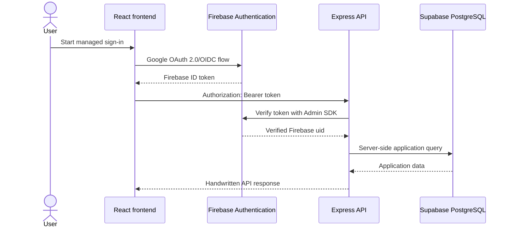

# Authentication foundation

## Scope

The Sport Analytics Tool uses Google Cloud Identity Platform through Firebase Authentication as its managed identity provider.

This foundation proves that the handwritten Express API can validate an authenticated Firebase identity. It does not implement final sign-up, sign-in, password-reset or account-deletion screens. It also does not define application roles, approved submitter permissions or sport-specific authorisation rules.

The provider selection is recorded in:

```text
evidence/decisions/ADR-002-firebase-authentication-foundation.md
```

## Architecture



Firebase manages identity. The Express API remains the trusted application boundary and the only application component that accesses Supabase-hosted PostgreSQL.

The frontend must not treat its local authentication state as proof of backend identity. Every protected backend request must include a token that the backend validates independently.

## Provider configuration

The development Firebase project contains:

- one registered web application for the React frontend;
- Google enabled as the initial federated sign-in provider;
- `localhost` authorised for local development; and
- no production users or production credentials.

Do not record the real project identifiers or Firebase configuration values in this document. Environment-specific values belong in ignored local files or deployment configuration.

## Environment variables

### Backend

| Variable                      | Required   | Purpose                                                                                     |
| ----------------------------- | ---------- | ------------------------------------------------------------------------------------------- |
| `NODE_ENV`                    | Yes        | Selects development, test or production safeguards.                                         |
| `PORT`                        | Yes        | Backend HTTP port.                                                                          |
| `CORS_ORIGINS`                | Yes        | Comma-separated frontend origins accepted by the API.                                       |
| `FIREBASE_PROJECT_ID`         | Yes        | Expected Firebase token audience and project identity.                                      |
| `FIREBASE_AUTH_EMULATOR_HOST` | Local only | Connects the Admin SDK to the Authentication Emulator using `host:port` without a protocol. |

The backend rejects `FIREBASE_AUTH_EMULATOR_HOST` when `NODE_ENV=production`.

### Frontend

| Variable                    | Purpose                                     |
| --------------------------- | ------------------------------------------- |
| `VITE_API_BASE_URL`         | Base URL of the handwritten Express API.    |
| `VITE_FIREBASE_API_KEY`     | Public Firebase web API identifier.         |
| `VITE_FIREBASE_AUTH_DOMAIN` | Firebase-managed authentication domain.     |
| `VITE_FIREBASE_PROJECT_ID`  | Public Firebase project identifier.         |
| `VITE_FIREBASE_APP_ID`      | Public Firebase web application identifier. |

Variables beginning with `VITE_` are included in the browser bundle. They must never contain private keys, service-account credentials, database passwords or administrative tokens.

## Local setup

### Prerequisites

- Node.js 20 or later
- npm 10 or later
- Java JDK 11 or later
- Firebase CLI or `npx firebase-tools`

### Configure the backend

Copy the safe example:

```powershell
Copy-Item -LiteralPath "apps/backend/.env.example" -Destination "apps/backend/.env"
```

Set the real development project ID only in the ignored file:

```env
NODE_ENV=development
FIREBASE_PROJECT_ID=your-development-project-id
FIREBASE_AUTH_EMULATOR_HOST=127.0.0.1:9099
```

Confirm that Git ignores the file:

```powershell
git check-ignore -v apps/backend/.env
```

### Start the Authentication Emulator

Use the development Firebase project ID without committing it to `firebase.json`:

```powershell
npx.cmd --yes firebase-tools@latest emulators:start --only auth --project YOUR_FIREBASE_PROJECT_ID
```

The configured local endpoints are:

- Authentication Emulator: `http://127.0.0.1:9099`
- Emulator UI: `http://127.0.0.1:4000`

Keep the emulator terminal open.

### Start the backend

In a separate terminal:

```powershell
npm.cmd run dev:backend
```

The backend starts on `http://127.0.0.1:3000` by default.

## Proof-of-concept endpoint

The authentication proof endpoint is:

```text
GET /api/v1/auth/me
```

An accepted identity returns:

```json
{
  "identity": {
    "subject": "<firebase-user-id>"
  }
}
```

Only the stable provider subject is returned. The endpoint does not expose email addresses, profile data, roles or sport-specific permissions.

## Rejection behaviour

A request without a valid bearer token receives:

```http
HTTP/1.1 401 Unauthorized
WWW-Authenticate: Bearer
```

```json
{
  "error": {
    "code": "UNAUTHORIZED",
    "message": "A valid authentication token is required."
  }
}
```

The same safe response is used for missing, malformed, invalid, expired or revoked tokens. Internal validation details are not returned to the caller.

## Automated verification

Run the backend tests:

```powershell
npm.cmd test --workspace @sport-analytics/backend
```

The authentication tests prove that:

- a request without a token receives `401`;
- a token rejected by the verifier receives `401`;
- a verified identity receives `200`; and
- the response contains the verified Firebase subject.

The test application injects a test verifier. It does not require live credentials or contact Firebase.

The manual emulator proof additionally exercises the real Firebase Admin SDK verification path. Evidence must redact the issued token and Firebase user identifier.

## Production credentials

Use Application Default Credentials or the deployment platform's managed identity mechanism where supported.

If a service-account credential is unavoidable during local deployment investigation:

- store it outside the repository;
- reference it through an ignored local environment or credential store;
- grant only the permissions required;
- never expose it to the frontend;
- never paste it into issues, Pull Requests, logs or documentation; and
- rotate it immediately if exposure is suspected.

Do not configure `FIREBASE_AUTH_EMULATOR_HOST` in production.

## Security controls

- Use HTTPS outside local development.
- Accept tokens only through the `Authorization` header.
- Never place tokens in URLs or query strings.
- Redact `Authorization` headers from request logs.
- Validate every protected request in the backend.
- Configure exact Firebase authorised domains and API CORS origins.
- Keep development and production Firebase projects separate.
- Keep Supabase database credentials backend-only.
- Do not commit `.env` files, service-account JSON, private keys or tokens.
- Do not infer application permissions from successful authentication.
- Add final role and scope checks only after the product decisions are approved.

## Dependency security note

The selected `firebase-admin` release currently includes transitive `uuid` audit findings through Google Cloud dependencies. The affected buffer-based UUID methods are not called directly by this authentication implementation. The project must retain the latest compatible Firebase Admin release, monitor upstream updates and rerun the production dependency audit regularly.

Do not use `npm audit fix --force` to downgrade Firebase Admin or force incompatible transitive dependency versions.

Run the production dependency audit with:

```powershell
npm.cmd audit --omit=dev
```

## Deferred work

The following work is intentionally outside Issue #14:

- final sign-up and sign-in pages;
- password-reset and account-deletion screens;
- application account persistence and provider-subject mapping;
- approved submitter roles;
- competition, season or fixture permissions;
- sport-specific authorisation rules; and
- production Firebase project creation.

## AI Declaration

The preceding document was planned and generated with the assistance of Codex[GPT-5].
