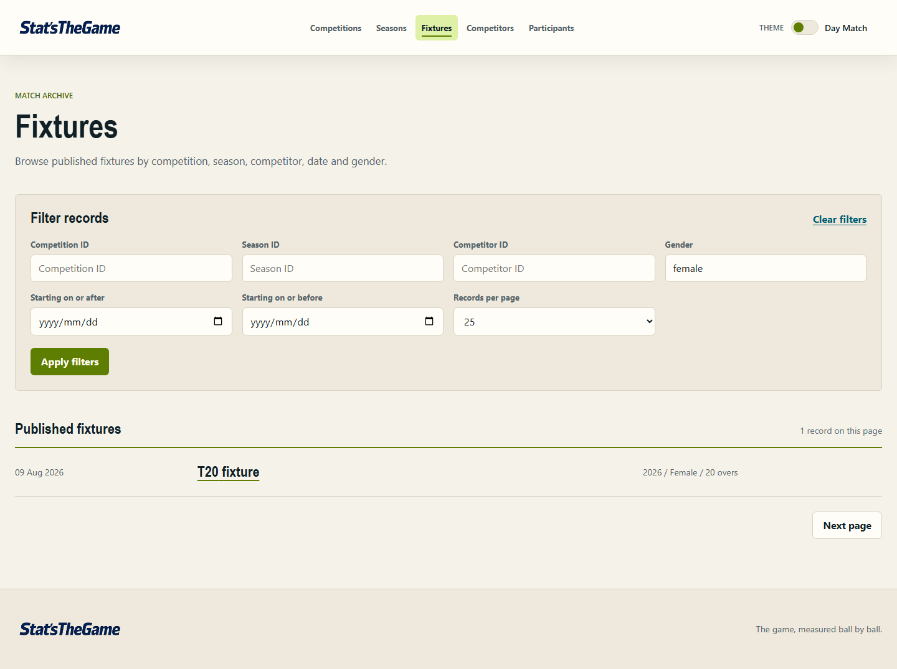
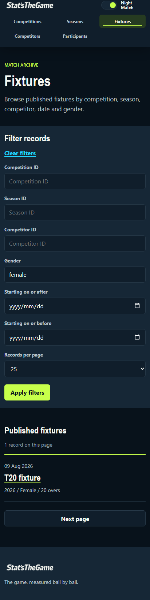
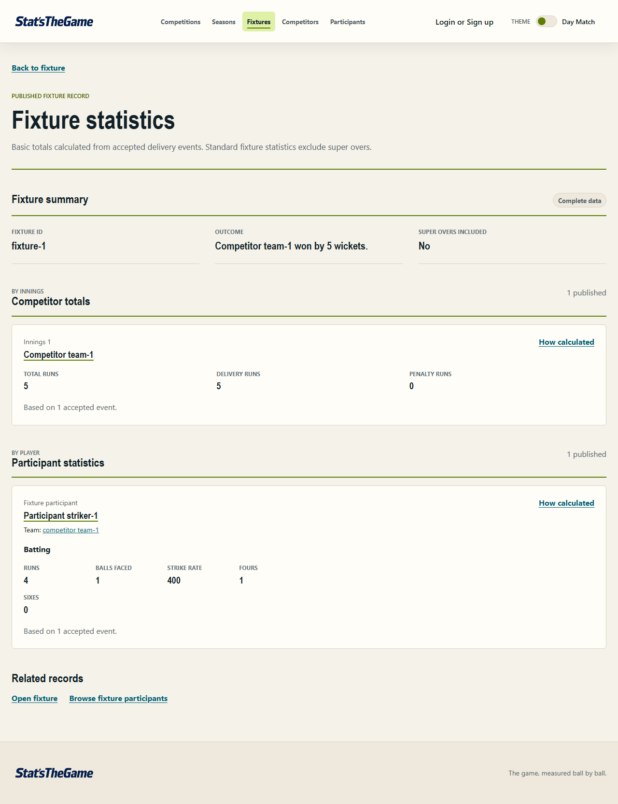
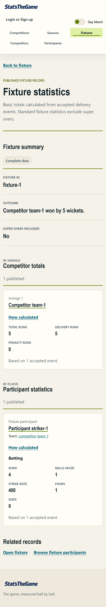

# ADR-007: Public cricket information architecture and interaction model

- **Status:** Accepted
- **Date:** 2026-08-19
- **Participants:** Nadav Sundy (document owner); project team
- **Approval:** Project-team approval of the design documents confirmed during issue #191
- **Related issue:** #191

## Context

The public frontend already provides a shared application shell, collection pages, record-detail
layouts, fixture-statistics components, responsive styles, Day Match and Night Match themes, and
the semantic tokens defined by the brand guidelines. These are the baseline for the next public
competition, season, fixture, team, and player journeys.

The current interface proves that the underlying routes and API contracts work, but it also exposes
implementation language such as `Competition ID`, `Season ID`, `Competitor ID`, `Fixture ID`,
`Competitors`, and `Participants`. Related records are often represented only by links to filtered
collection pages, fixture statistics occupy a separate destination, and player detail does not yet
contain match history or available performance statistics. Issue #191 supplies the design rules for
correcting those interaction problems; it does not authorise the corresponding frontend or API
implementation.

## Supplied design notes

The issue #191 description and acceptance criteria are the authoritative supplied design notes.
They require this decision to:

- keep technical references available internally without rendering them as user-facing content;
- identify competitions, teams, seasons, fixtures, and players with readable names;
- embed related records on detail pages;
- place fixture statistics in the fixture overview;
- place match history and available performance statistics on player pages;
- keep relevant information within three purposeful interactions of its public entry point;
- define loading, empty, partial-data, and error states for embedded sections;
- adapt the current shell, layouts, components, themes, and tokens; and
- record the approval status of the current brand guidelines.

No separate #191 design-note attachment was present in the repository when this record was written.
The current-interface screenshots reviewed as supporting evidence are attached under
[Review evidence](#review-evidence).

## Decision

### Public hierarchy

The public information hierarchy is organised around recognisable cricket concepts rather than API
resource names:

```text
Public application shell
├── Competitions
│   └── Competition overview
│       ├── Seasons
│       │   └── Season overview
│       │       └── Fixtures
│       ├── Fixtures grouped by season
│       └── Teams
├── Fixtures
│   └── Fixture overview
│       ├── Competition and season context
│       ├── Teams and players
│       ├── Fixture statistics
│       └── Accepted event detail where available
├── Teams
│   └── Team overview
│       ├── Competitions and seasons
│       ├── Fixtures
│       └── Players where available
└── Players
    └── Player overview
        ├── Available performance statistics
        ├── Match history
        └── Fixture overview with embedded statistics
```

Seasons remain directly reachable from competition content and may remain a public collection route,
but the main navigation does not need to give every hierarchy level equal prominence. The shell must
keep clear public entry points for competitions, fixtures, teams, and players. A season is presented
in its competition context rather than as an isolated technical resource.

### User-facing naming and internal references

Readable names are the primary identity in headings, links, filters, cards, breadcrumbs, accessible
names, and related-record sections.

| Concept     | Primary user-facing identity       | Human-readable disambiguation                        | Internal-only reference examples                 |
| ----------- | ---------------------------------- | ---------------------------------------------------- | ------------------------------------------------ |
| Competition | Competition name                   | Gender or format only when needed                    | `competitionId`; route and query values          |
| Season      | Season label with competition name | Year/date range or format when available             | `seasonId`; `competitionId`                      |
| Fixture     | Team name versus team name         | Date; competition; season; match type                | `fixtureId`; statistic and event identifiers     |
| Team        | Team name                          | Competition; season; gender or team type when needed | `competitorId`; API resource name `competitor`   |
| Player      | Player display name                | Team; fixture; season or role when available         | `participantId`; API resource name `participant` |

Stable identifiers, cursors, API resource terminology, and query values remain available for React
keys, URL construction, routing, API requests, caching, and telemetry. They must not appear as page
content, filter labels, placeholders, fallback headings, link text, or visible metadata. Opaque
identifiers may remain in URLs because the browser address is a technical routing surface rather
than the content identity.

When a readable name is missing, the interface shows a local partial-data message such as
`Team name unavailable`; it never substitutes the internal identifier. Duplicate names are
disambiguated with readable context rather than an ID.

User-facing cricket terminology is `Team` and `Player`. The existing backend and shared contracts
may continue to use `competitor` and `participant` internally until a separately approved contract
change requires otherwise.

### Detail-page contents

Each detail page renders its related records directly. A filtered-collection link may remain as a
secondary `View all` action, but it cannot be the only representation of related information.

| Page        | Overview content                                            | Embedded related sections                                                                               |
| ----------- | ----------------------------------------------------------- | ------------------------------------------------------------------------------------------------------- |
| Competition | Name; format/gender context when available                  | Seasons; fixtures grouped by season; teams                                                              |
| Season      | Season label; competition name; date context when available | Fixtures; teams                                                                                         |
| Fixture     | Named teams; date; competition; season; match context       | Fixture outcome and statistics; teams and players; accepted events where relevant                       |
| Team        | Team name; competition/season context                       | Fixtures; players where available                                                                       |
| Player      | Player name; team/context where available                   | Match history; available batting, bowling, and fielding performance statistics; links to named fixtures |

Fixture statistics are part of the fixture overview, below the fixture identity and essential match
context. A statistic-specific route may remain for deep links and calculation trace, but a user does
not have to leave the fixture overview to see the available fixture summary, team totals, or player
performances.

Player pages show only statistics supported by published data and the shared API contract. Missing
categories are handled as empty or partial data; the interface must not invent a zero or derive a
career aggregate in the browser. Match-history rows identify fixtures with named teams, date, and
competition/season context and include that player's available fixture performance.

### Collection-page interaction

Collections retain the existing heading, labelled filters, results heading, record list/card,
pagination, and state-message patterns. The following changes are required when the design is
implemented:

- search and filters use readable competition, season, team, fixture, and player values;
- relationship filters use labelled selectors or name search rather than free-text ID fields;
- every result link has a readable entity name and useful context;
- the user may follow a result directly to its detail page; and
- cursor pagination remains internal even though `Next page` remains visible.

### Desktop page structure

Desktop pages use the current content boundary, restrained maximum widths, and horizontal shell
where space permits:

```text
Application shell: wordmark | public navigation | account action | theme control
Page heading: eyebrow | readable title | concise purpose/context
Collection: labelled filters | results heading | readable result rows/cards | pagination
Detail: back/breadcrumb context | readable title | overview facts
        embedded related section(s), ordered by the user's likely next question
        secondary View all actions where useful
Footer
```

Related sections may use the existing multi-column card and metric layouts when the content remains
readable. Fixture statistics reuse the existing fixture summary, competitor-total, participant-
statistics, warning, and calculation-trace presentation, with user-facing labels changed to Team and
Player.

### Mobile page structure

Mobile pages preserve the same semantic heading and section order in one column:

```text
Application shell: wordmark and controls, followed by wrapped labelled navigation
Page heading: readable title and context
Collection: stacked labelled filters, full-width action, stacked results, full-width pagination
Detail: back/breadcrumb context, overview facts, then each embedded section in document order
Fixture/player statistics: stacked metric groups and cards
Footer
```

Essential related records and statistics are not hidden behind hover, icon-only controls, or a
desktop-only side panel. If a disclosure is introduced for a long optional section, it must be
keyboard operable, have an accessible name and expanded state, and count as a purposeful interaction
in the three-interaction measurement.

### Required journeys

#### Competition to season to fixture

When the target competition is already present in the entry-page results:

1. Activate the named competition to open its overview.
2. Activate a named season from the embedded seasons section.
3. Activate a named fixture from the season overview.

The fixture overview then displays its available statistics without another interaction.

When a name search is needed:

1. Apply the readable competition-name search.
2. Activate the named competition result.
3. Activate the named fixture in the competition overview's season-grouped fixture section.

The season remains visibly represented as the fixture group's heading and link, so this shorter path
preserves competition-to-season-to-fixture context without requiring a fourth interaction.

#### Player to fixture to statistics

When the target player is already present:

1. Activate the named player to open the player overview, which displays available performance
   statistics and match history.
2. Activate a named fixture in match history to open the fixture overview.

The player's available fixture performance and the fixture statistics are visible on their
respective overview pages. When player search is required, applying the readable-name search is
interaction 1, selecting the player is interaction 2, and selecting the fixture is interaction 3.

#### Team to fixture

A named team opens its overview in one interaction. A named fixture in its embedded history opens
the fixture overview in the second interaction; fixture statistics are then already present.

### Three-purposeful-interaction requirement

Measurement begins after the appropriate public entry page has loaded:

- competition information starts at the Competitions entry page;
- team information starts at Teams;
- player information starts at Players; and
- a known fixture may start at Fixtures.

A purposeful interaction is one user activation that changes the visible result set, reveals
required content, or navigates to another record. Applying a filter, choosing a search suggestion,
following a record link, changing page, or opening a required disclosure each counts as one.

Typing characters, moving focus, scrolling, hovering, reading, waiting for a request, switching
theme, and using the browser's Back action do not count. A loading failure and retry are reliability
conditions rather than the intended journey and are tested separately.

The requirement is satisfied when the target information is rendered and readable after no more
than three counted activations. Verification uses at least one competition/season/fixture path and
one player/fixture/statistics path at supported desktop and mobile widths. Each test records its
starting entry page, target information, activation sequence, and final count. Both an immediately
visible result and a name-search scenario are measured.

### Embedded-section states

The detail-page heading and successfully loaded overview remain visible when an embedded section is
still loading or fails.

| State        | Required presentation                                                                                                   |
| ------------ | ----------------------------------------------------------------------------------------------------------------------- |
| Loading      | Section heading and a local `role="status"` message describing which related information is loading                     |
| Empty        | Section heading and a calm explanation that no published records or statistics are available                            |
| Partial data | Render trustworthy available content; identify what is unavailable with text and the existing warning/status treatment  |
| Error        | Local `role="alert"` message; actionable wording; a keyboard-operable retry for that section without replacing the page |

Loading, empty, partial, and error states use the existing `state-message`, warning, card, section-
heading, and retry-button patterns. State is never communicated by colour alone. Embedded requests
must continue through the handwritten backend API and shared response contracts.

### Existing pattern reuse

The implementation must adapt these established frontend patterns before adding a new equivalent:

| Need                        | Existing pattern to adapt                                                                 |
| --------------------------- | ----------------------------------------------------------------------------------------- |
| Shell and public navigation | `PublicShell`; labelled responsive navigation; existing account and theme controls        |
| Collection layout           | `BrowseCollection`; `page-heading`; `filter-panel`; `record-list`; pagination             |
| Detail hierarchy            | `DetailLayout`; `RecordFacts`; related-record headings and cards                          |
| Fixture performance         | Existing fixture summary, metric cards, warnings, and calculation-trace components        |
| Async and empty feedback    | `state-message`; `role="status"`; `role="alert"`; local retry controls                    |
| Responsive behaviour        | Existing content boundaries, grid collapse, full-width mobile controls, and wrapped shell |
| Visual identity and themes  | Semantic CSS tokens; Day Match; Night Match; existing focus and reduced-motion treatments |

This decision introduces no new application architecture, API bypass, palette, typography, theme,
component library, animation system, or visual token.

### Brand guideline compliance and approval status

The current [Stat'sTheGame Brand and Interface Guidelines](../../docs/design/brand-guidelines.md)
are version 1.0 and are approved by the project team. Project-team approval of all design documents
was confirmed during issue #191 on 19 August 2026.

This design follows the approved guidelines. It reuses Day Match, Night Match, the existing semantic
palette and typography tokens, content boundaries, responsive breakpoints, component shapes, focus
treatment, and interface-writing rules. No palette, typography, theme, or architecture change is
part of this decision.

## Alternatives considered

### Continue displaying identifiers and technical resource names

Rejected because identifiers are routing and API concerns, not meaningful public cricket content.
They also make filtering and link text harder to understand.

### Keep related records only as filtered-collection links

Rejected because it hides the hierarchy, adds avoidable interactions, and prevents users from
understanding a competition, season, team, fixture, or player in place.

### Keep fixture statistics only on a separate page

Rejected because statistics answer the primary question about a fixture and would make both the
competition and player journeys longer than necessary.

### Create a new navigation shell or design system

Rejected because the current responsive shell, themes, tokens, collection layouts, detail layouts,
and statistics components already provide the required foundation.

## Advantages

- Cricket concepts and readable names define the public experience.
- Related information is visible in context and remains within the three-interaction limit.
- Desktop and mobile share one semantic hierarchy.
- Fixture and player performance information is easier to discover.
- Existing components, themes, and architectural boundaries remain reusable.

## Disadvantages

- Some views require richer related-record and readable-name data than current contracts expose.
- Embedded sections create multiple independently managed loading and failure states.
- Large fixture histories require bounded lists, pagination, or a secondary `View all` action.

## Consequences

- Existing opaque routes and API identifiers remain valid, but future frontend work removes them
  from rendered content.
- Future shared-contract and handwritten-backend work may be required to supply named relationships,
  embedded lists, player match history, and supported player aggregates. That work requires its own
  scoped issue and must not be implemented as uncontracted browser-side joins or calculations.
- Current `Competitors` and `Participants` labels become `Teams` and `Players` in user-facing copy;
  internal contract terms do not have to change.
- The current screenshots remain baseline evidence, not proof that the future implementation already
  satisfies this decision.
- This record and the brand guidelines are approved design documents; future changes remain subject
  to the normal issue and Pull Request review process.

## Verification and review date

Review this decision during the Pull Request for #191 and again before accepting the frontend/API
implementation that applies it. Verification for that implementation must confirm:

- no internal identifiers or technical resource terms appear as user-facing identity;
- desktop and mobile follow the documented structures in both themes;
- competition/season/fixture and player/fixture/statistics journeys meet the recorded interaction
  counts;
- related records and fixture statistics render directly on the relevant detail pages;
- player pages contain match history and only supported performance statistics;
- every embedded section has loading, empty, partial-data, and error handling as applicable; and
- reused components and tokens still meet accessibility and responsive checks.

## Review evidence

The following existing screenshots were inspected for reusable shell, collection, detail,
statistics, theme, and responsive patterns. They are attached here as links to the repository's
original evidence files.

### Public collection — desktop Day Match

[](../validation/issue-48-public-browsing-desktop.png)

### Public collection — mobile Night Match

[](../validation/issue-48-public-browsing-mobile.png)

### Fixture statistics — desktop Day Match

[](../validation/issue-54-public-statistics-desktop.png)

### Fixture statistics — mobile Day Match

[](../validation/issue-54-public-statistics-mobile.png)

## AI Declaration

This decision record was drafted and reconciled with the repository with the assistance of
Codex[GPT-5.6 Sol].
