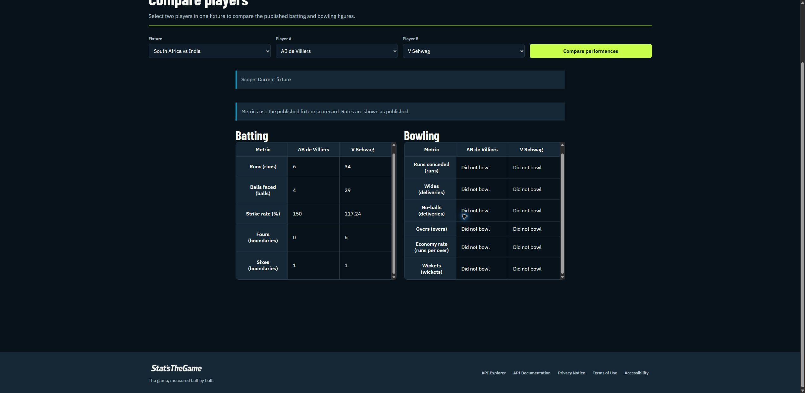

# Comparison technical follow-up after P15's session

Codex inspected the participant-supplied public comparison URL after Gabriel returned. This is technical corroboration, not observation of P15's attempt or a human retest. Exact deployed commits remain unconfirmed.

URL: <https://sport-analytics-tool-web.pages.dev/participants/compare?fixtureId=8945&playerA=14239&playerB=106>.

The rendered page shows South Africa vs India, AB de Villiers and V Sehwag, and scope Current fixture. Batting values match the participant report: runs 6/34, fours 0/5, sixes 1/1. The player selectors and result headers show player names without team membership. This supports F01's reported context concern without changing the task outcome.

At the current 2560 × 1249 CSS-pixel viewport, each `.ui-data-table` wrapper has client height 436 and scroll height 456, with vertical overflow auto. Both display vertical scrollbars for these short scorecards. Width is 495 with scroll width 495: no horizontal overflow was measured in this check. This supports F03; the participant's original viewport is not known. Any fix should preserve scrolling where larger results or narrow layouts need it.

Recommendations pending Gabriel/team evaluation: expose each player's fixture team (F01, proposed S3); let these short scorecards expand vertically (F03, proposed S4); retain clarified score notation as novice context with no product change (F02, no defect established). Existing-issue lookup remains required before filing or implementing a change. No fix, approved decision or retest is claimed.

Prepared with Codex[GPT-6] from actual rendered DOM measurements and a browser screenshot.

Subsequent decision: Gabriel approved F01 S3/F03 S4 improvements and F02 no change. Existing #800 covers the accepted comparison readability work; closed #716 addressed earlier discoverability. No fix or retest is claimed.
