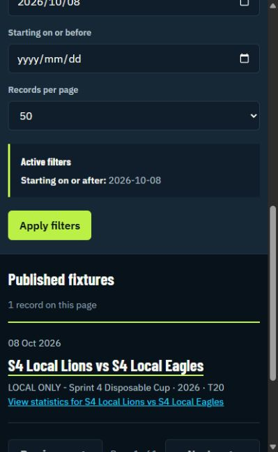
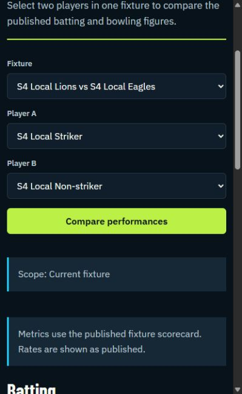
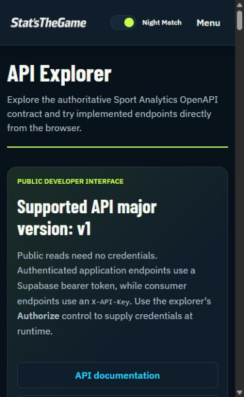

# Issue 803 — AI simulated public-user session

## Session identity and limits

- Date: 7 October 2026, Africa/Johannesburg.
- Tester: Codex (GPT-6), identifier AI-SIM-01; an AI simulation, not a human participant.
- User request: act as a user unfamiliar with the app and complete a session.
- Starting state: local homepage in the Codex in-app browser, showing public navigation; no account sign-in was performed. The user's signed-in Chrome tab was not used.
- Environment: `http://localhost:5183`, disposable local fixtures previously published by the human tester. Checkout HEAD recorded earlier in this session: `958c431482b6347abfbcae6ccf4fe3f50da6952a`.
- Method: navigate using visible links, labels and controls through the browser's DOM interface; retain screenshots and DOM snapshots at key stages. No application source, direct API calls or database inspection were used to solve these tasks.
- Prior knowledge: the tester already had conversation context, prepared the data and had read the task bank. A genuinely unfamiliar human perspective cannot be claimed. No human feelings, quotes, task timings or usability scores are fabricated.
- Scope: PUB-01, PUB-02, PUB-03, PUB-06 and PUB-05, using the canonical task bank goals. Authentication, submission/review, export downloads and API-key tasks were not attempted.

## Task observations

These are **simulation outcomes**, separate from human Success/Partial/Failure counts.

| Task                                    | Actions through the interface                                                                                                             | Observed outcome                                                                                                                                                                                                                                                                                         |
| --------------------------------------- | ----------------------------------------------------------------------------------------------------------------------------------------- | -------------------------------------------------------------------------------------------------------------------------------------------------------------------------------------------------------------------------------------------------------------------------------------------------------- |
| PUB-01 — Discover Data                  | Homepage → Browse fixtures → first S4 Local Lions vs S4 Local Eagles fixture.                                                             | Completed. Two dated records were listed. Overview provided competition, season, team links, T20 format, date and scheduled overs; unavailable venue/toss/weather were explicit.                                                                                                                         |
| PUB-02 — Find Statistics                | Fixture overview → Statistics; open Statistic definitions.                                                                                | Completed. Published innings was 4/1 from 0.2 overs; striker had 4 runs from 2 balls and was caught, bowler had 1 wicket. Definitions explained SR, economy, run rate, the not-out asterisk and undefined values.                                                                                        |
| PUB-03 — Narrow the Data                | Return via Fixtures breadcrumb; enter 2026-10-08 in Starting on or after; Apply filters.                                                  | Completed. Results narrowed from two fixtures to the one dated 8 October. Active filters showed the exact selected date.                                                                                                                                                                                 |
| PUB-06 — Compare Meaningful Performance | Filtered fixture's View statistics → Compare player performances; choose S4 Local Striker and S4 Local Non-striker; Compare performances. | Completed. Current-fixture scope was explicit. Striker scored 4 from 2 balls with one four; non-striker scored 0 from 0 balls. Striker contributed more runs in this sample; the non-striker had no batting opportunity, so this does not establish general ability. Both correctly showed Did not bowl. |
| PUB-05 — API Discovery                  | Footer API Explorer link; inspect authentication guidance, server selector and endpoint list.                                             | Completed for discovery. Public reads require no credentials; application endpoints use a Supabase bearer token, consumer endpoints use X-API-Key. Fixture, event, statistics and JSON/CSV export paths were discoverable. No request was executed and no credentials were supplied.                     |

## Observations for human evaluation

| ID      | Observed fact                                                                                                                                                                        | Possible effect / recommendation                                                                                                                                   | Status                                                               |
| ------- | ------------------------------------------------------------------------------------------------------------------------------------------------------------------------------------ | ------------------------------------------------------------------------------------------------------------------------------------------------------------------ | -------------------------------------------------------------------- |
| SIM-F01 | Comparison Fixture dropdown displayed two options with the identical label S4 Local Lions vs S4 Local Eagles, without dates. The earlier fixture archive distinguished them by date. | A user selecting directly in comparison cannot distinguish these fixtures by label. Include date/competition context in fixture options.                           | AI observation; not human feedback, severity/decision pending.       |
| SIM-F02 | Player dropdowns and comparison result headers showed player names without team context.                                                                                             | Team context would help selection and interpretation. This overlaps previously recorded F01 under #800; do not create a duplicate finding or claim a human retest. | Technical observation on this older local checkout.                  |
| SIM-F03 | Statistic definitions explained SR/Econ/RR but did not explain the 4/1 notation or 0.2 overs.                                                                                        | Consider explaining runs/wickets and completed overs plus balls near the summary for cricket novices. This simulation cannot establish actual novice confusion.    | Suggestion requiring human evaluation; not a demonstrated defect.    |
| SIM-F04 | API Explorer selected a deployed development server and offered local `http://127.0.0.1:3000`; this kit's API is on 3083, which was not offered.                                     | Local testing through Try it out would target another environment unless the server configuration is adjusted. Clarify environment or make the kit API selectable. | Test-kit/environment limitation observed; no remote calls attempted. |

## Retained evidence

### Date filtering

[DOM snapshot](01-filtered-fixtures.txt).

### Player comparison

[DOM snapshot](02-player-comparison.txt).

### API discovery

[DOM snapshot](03-api-discovery.txt).

## Completion boundary

The five selected public/API-discovery simulation tasks are complete. The session adds supplemental browser evidence and candidate improvements. It does not add a human participant, satisfy the minimum human-session count for #803, replace human feedback, or close the issue. Retain it separately from P15 and the user-confirmed assisted local participant session.
