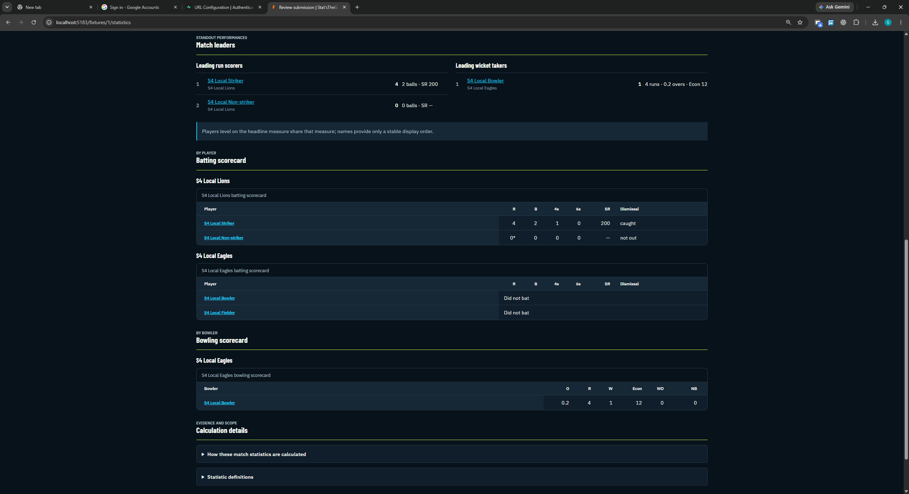
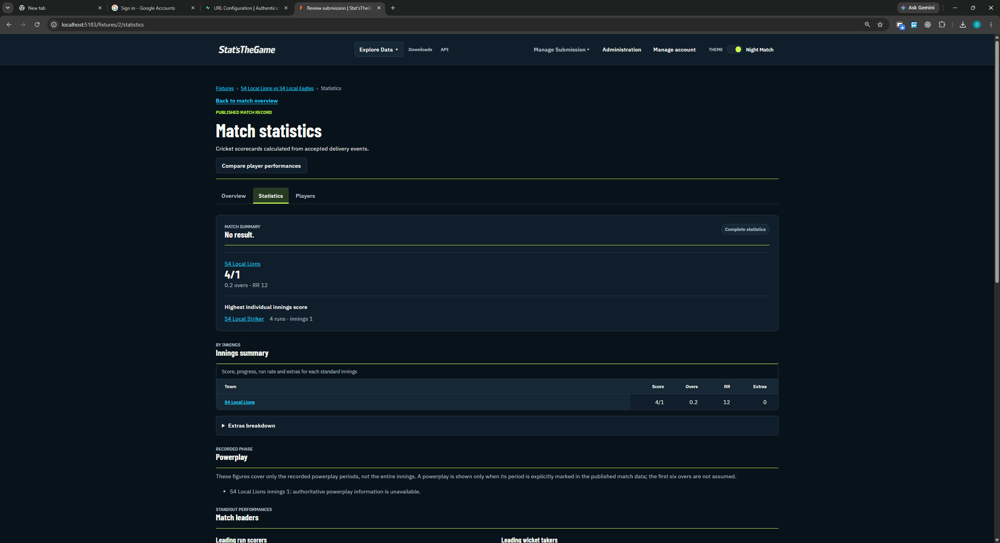

# Issue 803 — assisted local participant session, 7 October 2026

## Context and scope

The user confirmed that this was a real participant session, correcting Codex's initial rehearsal classification. The actions were performed in the local app and the user supplied seven screenshots during this conversation. Codex preserved all original PNG files in the primary checkout. Five originals contain an account name and are withheld from this branch pending redaction under the testing protocol; the two statistics screenshots below contain synthetic player names and are included. Step-by-step navigation, the deliberately invalid field, the corrected file and role-grant instructions were supplied during the session. Record this as one assisted session spanning submitter and reviewer workflows, not two separate sessions. Participant identifier and familiarity remain to be confirmed; the account display name does not establish who operated the app.

The [testing protocol](../../../../../docs/testing/user-testing-protocol.md) defines Success as completion without assistance and Partial as meaningful progress or completion requiring facilitator intervention. These assisted workflow completions therefore support Partial outcomes, even though the functional results are correct. Exact canonical task mapping and participant feedback remain to be finalized; do not fabricate task attempts or timing.

- Environment: frontend `http://localhost:5183`, API `http://localhost:3083/api/v1`, isolated PostgreSQL database `sport_analytics_803` on port 55483.
- Source checkout HEAD recorded during documentation: `958c431482b6347abfbcae6ccf4fe3f50da6952a`. This identifies the checkout, not a separate deployed build.
- Browser: Chrome on Windows; browser version was not recorded.
- Competition: `LOCAL ONLY - Sprint 4 Disposable Cup`, ID 1.
- Fixtures: S4 Local Lions vs S4 Local Eagles, fixture 1 dated 2026-10-07 and fixture 2 dated 2026-10-08.
- One local account was changed from viewer to submitter, then admin. This does not demonstrate testing with separate submitter and reviewer identities.
- Input files and hashes: [kit manifest](../../SHA256SUMS.txt).

## Observed results

| Check                | Screenshot evidence         | Result                                                                                                                                                      |
| -------------------- | --------------------------- | ----------------------------------------------------------------------------------------------------------------------------------------------------------- |
| Valid upload         | Submission history          | `01-valid.json`: awaiting review, 2 accepted, 0 rejected.                                                                                                   |
| Invalid upload       | Invalid validation report   | `02-invalid.json`: rejected, 0 accepted, 2 rejected; `PACKAGE_ITEM_INVALID · contractVersion`; report says nothing was published.                           |
| Corrected retry      | Corrected validation report | `03-corrected.json`: package version 1.0, awaiting review, 2 accepted, 0 rejected, 0 unresolved, 0 duplicates and 0 conflicts.                              |
| Review readiness     | Corrected review summary    | 2 accepted, 0 blocking errors, 2 resolved references, no unresolved references or conflicts; intended fixture dated 2026-10-08.                             |
| Publication          | Published review history    | Both `01-valid.json` and `03-corrected.json` are Published with 2 accepted records each. Invalid batch remains Rejected. Nothing needs review.              |
| Fixture 1 statistics | Fixture 1 scorecards        | Striker: 4 runs from 2 balls, one four, caught. Bowler: 0.2 overs, 4 runs, 1 wicket, 0 wides, 0 no-balls. This confirms 4 runs, 1 wicket and 2 legal balls. |
| Fixture 2 statistics | Fixture 2 statistics        | Innings summary: 4/1 from 0.2 overs, run rate 12, extras 0. This confirms the same expected totals.                                                         |

Cricket notation `0.2 overs` means two balls, not a decimal fraction of an over. The fixtures are tiny synthetic records; the displayed “No result” is consistent with the fixture setup.

### Batch references

| File                | Batch reference                        |
| ------------------- | -------------------------------------- |
| `01-valid.json`     | `6679920c-318e-4cda-94a0-eabdb09ae4b4` |
| `02-invalid.json`   | `bc7f5db7-2e52-4bf9-8200-df5078669535` |
| `03-corrected.json` | `045a8874-b878-4d8e-abb0-e8ba468b380a` |

References were transcribed from the screenshot URLs/history. The corrected upload was made through New submission for fixture 2; these screenshots do not establish a linked reviewer-requested replacement workflow.

## Screenshots

### 1. Valid and invalid submission history

Original `01-submission-history.png` retained locally; redacted copy pending. Visible result transcribed in the table above.

### 2. Invalid package validation report

Original `02-invalid-validation-report.png` retained locally; redacted copy pending. Visible result transcribed in the table above.

### 3. Corrected package validation report

Original `03-corrected-validation-report.png` retained locally; redacted copy pending. Visible result transcribed in the table above.

### 4. Corrected package review summary

Original `04-corrected-review-summary.png` retained locally; redacted copy pending. Visible result transcribed in the table above.

### 5. Published review history

Original `05-published-review-history.png` retained locally; redacted copy pending. Visible result transcribed in the table above.

### 6. Fixture 1 published scorecards

### 7. Fixture 2 published statistics

## Conclusion and remaining work

The screenshot evidence supports completion of the local valid upload → invalid rejection → corrected retry → reviewer publication → expected published statistics participant session, with assistance recorded. No timing, unassisted usability outcome, direct database audit or approval-dialog capture is claimed. Dropdown scrolling (#907) and intermittent submission access errors (#909) were not assessed by this session.

Together with the previously recorded P15 public session, this provides two recorded session events. Confirm participant identity before reporting a distinct participant count. Issue #803 still requires the remaining session coverage, feedback evaluation, required fix retests and final summary. The directory retains its original name to preserve existing links. Before another attempt, follow the kit's reset instructions and verify clean fixtures; the current fixtures already contain published deliveries.
